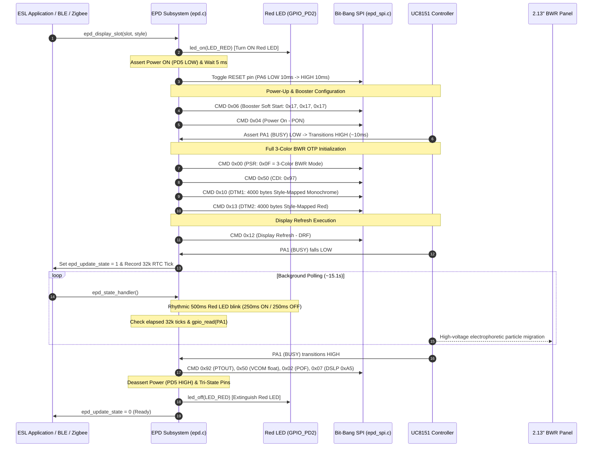

# UC8151 / IL0373 2.13" E-Paper Subsystem — Architecture, Refresh Waveforms & Engineering Learnings

This document is the authoritative engineering reference for the E-Paper Display (EPD) subsystem on the Hanshow Stellar-M3N@ / E31HA Electronic Shelf Label (ESL). It covers the display controller architecture, hardware connections, electrophoretic physical properties, empirical testing of all refresh acceleration techniques, and the technical rationale for the production firmware implementation.

---

## 1. System Overview

The ESL tag integrates a **Telink TLSR8258** 32-bit wireless SoC connected to an **UltraChip UC8151** (also designated as **IL0373**) display controller driving a 2.13-inch tri-color (Black/White/Red) electrophoretic display panel (250 × 122 resolution).

```
┌─────────────────────────────────────────────────────────────────────────┐
│                    Telink TLSR8258 Host SoC (MCU)                       │
│  - BLE 5.0 / Zigbee 3.0 Dual-Stack Runtime                              │
│  - Non-Blocking Display State Machine (src/epd/epd.c)                   │
│  - Display Buffer Mapper & Formatter (src/epd/epd_bwr_213.c)            │
│  - Bit-Bang SPI Master Interface (src/epd/epd_spi.c)                    │
│  - 32 kHz Real-Time Clock Timer for Asynchronous Busy Polling          │
└──────────────┬───────────────────────────────▲──────────────────────────┘
               │ PD7 (EPD_CS) Active-Low       │ PA1 (EPD_BUSY)
               │ PD6 (EPD_CLK) SPI Clock       │ (Low=Busy, High=Ready)
               │ PA0 (EPD_MOSI) SPI Data       │
               │ PD2 (EPD_DC) Data/Command     │
               │ PA6 (EPD_RESET) Active-Low    │
               │ PD5 (EPD_PWR) Power Gate      │
               ▼                               │
┌──────────────────────────────────────────────┴──────────────────────────┐
│              UltraChip UC8151 / IL0373 EPD Controller                   │
│  - Internal DC-DC Boost Converter (+11V VDH / -11V VDL Charge Pump)     │
│  - On-Chip OTP ROM Waveform Tables (Factory Calibrated 2C & 3C LUTs)   │
│  - 4,000-byte DTM1 SRAM Plane (Black/White / Previous Frame)            │
│  - 4,000-byte DTM2 SRAM Plane (Red / New Target Frame)                  │
│  - Source & Gate Drivers (128 Source Outputs × 250 Gate Outputs)        │
└──────────────────────────────────────────────┬──────────────────────────┘
                                               │
                                     Flexible Film Substrate
                                               │
┌──────────────────────────────────────────────▼──────────────────────────┐
│              2.13" BWR Electrophoretic E-Ink Panel                      │
│  - Physical Resolution: 250 (H) × 122 (V) Pixels                        │
│  - Microcapsule Suspension: White (-), Black (+), Red (+) Pigments      │
│  - True Bi-Stable Display (Zero Current Draw when Static)               │
└─────────────────────────────────────────────────────────────────────────┘
```

### 1.1 Pin Connections & Hardware Interface

| Pin | Net | Function | Direction | Physical / Electrical Behavior |
| :--- | :--- | :--- | :--- | :--- |
| `PA1` | `EPD_BUSY` | Refresh Status | Input (MCU) | **Active-Low during refresh**. Reads HIGH (`1`) when idle/ready. Internal pull-up. |
| `PA6` | `EPD_RESET` | Hardware Reset | Output (MCU) | Active-Low. Held LOW for 10 ms to perform hard silicon reset. |
| `PD2` | `EPD_DC` | Data / Command | Output (MCU) | LOW = SPI byte is Command opcode; HIGH = SPI byte is Data parameter. |
| `PD7` | `EPD_CS` | Chip Select | Output (MCU) | Active-Low SPI slave select. Asserted LOW during SPI transmission. |
| `PD6` | `EPD_CLK` | SPI Clock | Output (MCU) | Bit-bang SPI clock line, idling LOW (CPOL=0, CPHA=0). |
| `PA0` | `EPD_MOSI` | SPI Master Out | Output (MCU) | Serial data output, sampled on rising edge of `PD6`. |
| `PD5` | `EPD_PWR` | Power Switch | Output (MCU) | High-side MOSFET / P-channel power gate. LOW = Power ON; HIGH = Power OFF. |

> [!IMPORTANT]
> **Complete Power Isolation:** When the display enters deep sleep, `PD5` is driven HIGH to cut VDD, and all digital IO pins (`PA0`, `PA6`, `PD2`, `PD6`, `PD7`) are floated/tri-stated to prevent parasitic current from leaking through ESD protection diodes into the unpowered UC8151 controller.

---

## 2. Electrophoretic Physics & Refresh Mechanics

### 2.1 The 3-Color BWR Microcapsule System

The 2.13-inch panel uses E-Ink Spectra microcapsule electrophoretic technology containing three types of charged pigment particles suspended in a transparent dielectric fluid:

1. **White Particles:** Negatively charged ($-$), low mass, **high mobility**.
2. **Black Particles:** Positively charged ($+$), medium mass, **medium mobility**.
3. **Red Particles:** Positively charged ($+$), large mass, **low mobility**.

Because black and red pigments share the same positive polarity ($+$), separating them requires complex electrical waveform sequences:
- **Short, high-frequency voltage pulses** move the agile black particles to the front without dragging the sluggish red particles.
- **Long, sustained high-voltage pulses** provide the continuous electrostatic force required to pull the heavy red particles through the viscous fluid to the surface.
- **Reverse charge-balancing pulses** ensure the net DC bias across each microcapsule equals zero ($\int V \, dt = 0$) over the complete refresh cycle, preventing irreversible electrochemical degradation of the display panel.

---

## 3. High-Level Architecture & Division of Labor

```
                                [ Application Slot Event ]
                                             │
                                             ▼
                                [ epd_display_slot(slot, style) ]
                                             │
                                ┌────────────┴────────────┐
                                ▼                         ▼
                        Turn ON Red LED              Power On Panel
                        (GPIO_PD2 = 0)             (PD5 LOW, PA6 Reset)
                                │                         │
                                └────────────┬────────────┘
                                             │
                                             ▼
                                [ Full BWR 3-Color OTP ]
                                   PSR = 0x0F (BWR OTP)
                                   DTM1 = Style-Mapped Mono Plane
                                   DTM2 = Style-Mapped Red Plane
                                             │
                                             ▼
                                   [ Trigger DRF: 0x12 ]
                                             │
                                    UC8151 BUSY Falls LOW
                                             │
                          [ Asynchronous 32k RTC Handler ]
                           Red LED actively lit on PD2
                           Polling PA1 in Background Loop
                                             │
                                  BUSY Transitions HIGH
                                             │
                          [ Deep Sleep & Isolation (0x07) ]
                           Cut PD5 Power Gate, Turn OFF Red LED
```

### 3.1 Division of Labor

1. **Host MCU (TLSR8258):**
   - Drives Red status LED (`GPIO_PD2`) LOW (ON) when refresh is triggered, keeping it lit while `epd_update_state == 1`.
   - Manages power-up, hardware reset, and SPI command configuration.
   - Transforms packed 1-bit monochrome and red image buffers into the controller's internal SRAM coordinate layout on-the-fly according to the active `render_style` (`0`..`4`).
   - Monitors `PA1` (BUSY) asynchronously using 32 kHz timer ticks, allowing concurrent Bluetooth / Zigbee radio processing during display refresh.
   - Coordinates orderly shutdown (`PTOUT` $\rightarrow$ `CDI` $\rightarrow$ `POF` $\rightarrow$ `DSLP` $\rightarrow$ `EPD_POWER_OFF`) and turns OFF the Red LED.

2. **Display Controller (UC8151 / IL0373 Silicon):**
   - Controls on-chip DC-DC charge pump generating $+11\text{ V}$ ($V_\text{DH}$) and $-11\text{ V}$ ($V_\text{DL}$).
   - Executes hardcoded factory One-Time-Programmable (OTP) ROM 3-color lookup tables (PSR `0x0F`).
   - Drives 128 source lines and 250 gate lines with precise sub-frame timing and phase alternation.
   - Drives `PA1` LOW during refresh execution and asserts it HIGH when the sequence terminates (~15.1 seconds).

---

## 4. Empirical Findings: Refresh Waveforms & Color Saturation

During development, multiple refresh modes and acceleration techniques were evaluated on real hardware:

### 4.1 Production Implementation: Full 3-Color BWR OTP (`PSR = 0x0F`)
- **Measured Duration:** **~15.15 seconds**.
- **Visual Quality:** Fully saturated, rich red pigments and deep, crisp black contrast with zero ghosting or faded text.
- **Physical Rationale:** Standard factory 3-color OTP sequence. Because the E-Ink Spectra microcapsules contain sluggish positively charged red particles alongside medium-mobility black particles and high-mobility white particles, a full multi-phase AC driving sequence is required to properly separate pigments.
- **Hardware Status Indicator:** The firmware forces the **Red status LED (`GPIO_PD2`) ON** at the start of every refresh cycle, maintaining visual indication that the screen is updating, and extinguishing the LED only after `PA1` goes HIGH and the panel enters deep sleep.

### 4.2 Factory 2-Color KW OTP Mode (`PSR = 0x1F`)
- **Measured Duration:** **12.74 seconds** (measured via `test_fast_refresh.c`).
- **Observed Behavior:** **Noticeably faded, washed-out color and weak black contrast.**
- **Root Cause:**
  - Setting `PSR = 0x1F` instructs the UC8151 to run a 2-color monochrome LUT stored in the factory OTP ROM.
  - In a 3-color physical microcapsule suspension, skipping the red-stabilization phase leaves the positively-charged red and black pigment particles in an incompletely resolved state, degrading optical density and leading to washed-out gray tones and a slight pinkish background haze.
  - Speedup is marginal (~2.4s faster than 15.15s, a 16% reduction) while degrading contrast, which does not justify its use.

### 4.3 Systematic Testing of Dynamic Acceleration Techniques

Using the fast dynamic prototyping subsystem (`docs/prototype.md`), all candidate acceleration techniques were empirically evaluated on real hardware:

#### Failure 1: Register-Based LUT without Partial Window (`PSR = 0x3F`, `PTOUT 0x92`)
- **Observed Behavior:** Refresh took **12.05 seconds**. The display rendered horizontal dark red/black stripes immediately, followed ~10 seconds later by light vertical stripes with faded contrast. Black pixels did not reliably turn white.
- **Root Cause:**
  - `PSR = 0x3F` configured resolution bits `RES[1:0] = 00` (96×230).
  - Calling `0x92 (PTOUT)` explicitly turned partial mode off.
  - The UC8151 controller rejected the register LUT and fell back to executing the internal **12-second factory monochrome OTP ROM**.
  - In the OTP sequencer, the initial horizontal stripes were caused by the gate-line clear/shake sweep across the 250 gate lines; ~10 seconds later, the source-line data drive phase rendered the vertical stripes.

#### Failure 2: Register-Based LUT with Partial Window Mode (`PSR = 0xBF`, `PTIN 0x91` + `PTL 0x90`)
- **Observed Behavior:** **Timeout (>15s), `BUSY` (PA1) stayed LOW (`0`) indefinitely, screen completely frozen without updating.**
- **Root Cause:**
  - When programmed with `PSR = 0xBF` (`RES = 128x296`, `REG = 1`, `FORMAT_BW = 1`) and partial mode activated via `0x91 (PTIN)` + `0x90 (PTL)`, the UC8151 entered the register LUT state machine.
  - However, because the physical panel and chip bonding are configured for a 3-color Spectra BWR electrophoretic microcapsule suspension, the internal hardware sequencer stalled waiting for conditions/counters that never complete on BWR silicon.
  - The charge pump remained locked, and `PA1` stayed LOW until the snippet failsafe watchdog forced panel shutdown.

#### Failure 3: Temperature Sensor Spoofing (`0x41 0x80` + `0xE5`)
- **Observed Behavior:** **Timeout (>35s), screen stained red.**
- **Root Cause:**
  - In an attempt to force the controller into a higher-temperature factory OTP table (where higher particle mobility theoretically yields a faster refresh), command `0x41 (0x80)` (TSE: External Temperature Sensor Enable) was sent.
  - The Hanshow Stellar-M3N@ PCB **does not have an external thermistor** connected to the UC8151's analog sensing pin.
  - The internal ADC hung indefinitely awaiting a conversion voltage, while holding continuous high DC bias across the panel. Over the 35-second hang, this continuous electrostatic field pulled red pigment particles to the front electrode, permanently staining the screen red until erased by a subsequent full refresh.

#### Failure 4: PLL Frequency Overclocking (100 Hz / 200 Hz via `0x30`)
- **Observed Behavior:** **Refresh took ~13.3s; contrast severely degraded / faded gray.**
- **Root Cause:**
  - The overall OTP sequencer duration on the UC8151 is hardcoded to fixed frame counters derived from internal RC dividers; altering register `0x30` did not significantly accelerate the sequence.
  - However, doubling (100 Hz, `0x3A`) or quadrupling (200 Hz, `0x39`) the PLL frame clock halved or quartered the duration ($\Delta t$) of each individual driving voltage pulse.
  - In electrophoretic ink, particle displacement $\Delta x$ is proportional to the voltage impulse:
    $$\Delta x \propto \int_0^T V(t) \, dt$$
  - With pulse widths cut in half, black particles lacked the electrical impulse needed to travel through the fluid to the front capsule surface, leaving washed-out gray text instead of deep black.

#### Failure 5: SPI Command Stream Desynchronization (`0x61`)
- **Observed Behavior:** **Display stopped updating completely; existing content bleached white.**
- **Root Cause:**
  - Command `0x61` (TRES - Resolution Setting) strictly requires **4 parameter bytes** on UC8151 ($H_\text{res}$ MSB, $H_\text{res}$ LSB, $V_\text{res}$ MSB, $V_\text{res}$ LSB).
  - An earlier implementation sent only 3 data bytes (`0x80, 0x01, 0x28`).
  - The controller consumed the subsequent command byte (`0x50` - CDI) as the 4th parameter of `0x61`, and interpreted `0x97` as an unknown command.
  - This phase shift corrupted all subsequent DTM1/DTM2 image data packets, clearing the internal frame buffer to white on every refresh.

#### Failure 6: GPIO Port Read Bitmask Trap (`PA1`)
- **Observed Behavior:** **Firmware repeatedly reported `Refresh TIMEOUT (>35s)` even though the screen had visibly refreshed.**
- **Root Cause:**
  - On the Telink TLSR8258 SDK, `gpio_read(GPIO_EPD_BUSY)` returns the raw port bitmask `(reg & pin)`. For `GPIO_PA1` (`BIT(1)`), the returned value is `0` (low) or `2` (high)—**never `1`**.
  - Evaluating `if (gpio_read(GPIO_EPD_BUSY) == 1)` evaluated to FALSE indefinitely, triggering false timeout errors.
  - The expression must test `!= 0` or cast to boolean `(bool)gpio_read(...)`.

### 4.4 Cross-Library & Industry Corroboration

These empirical findings match the published behavior in major open-source display drivers:

1. **`GxEPD2` (Jean-Marc Zingg):**
   - For `GxEPD2_213_Z19c` (GDEW0213Z19, 2.13" BWR on UC8151D), `usePartialUpdateWindow` is set to `false` and `hasFastPartialUpdate` is set to `false`.
   - ZinggJM confirmed on Arduino forums: *"The GDEW0213Z19 supports only full-screen refresh; partial refresh is not supported due to limitations of the display controller."*
2. **Adafruit CircuitPython (`adafruit_uc8151d`):**
   - Register LUTs (`_GRAYSCALE_START_SEQUENCE`, `PSR = 0xBF`) are only enabled on flexible **monochrome (B&W)** 2.9" panels.
   - For Tri-Color panels (`_COLOR_START_SEQUENCE`), the driver strictly enforces factory OTP mode (`0x0F`), because the silicon locks up if register LUTs are driven to a 3-color microcapsule matrix.

### 4.5 Comparative Summary of Evaluated Refresh Modes

| Mode | Controller Register / Configuration | Measured Duration | Visual Quality & Contrast | Practical Viability |
| :--- | :--- | :--- | :--- | :--- |
| **Full 3-Color BWR OTP** | `PSR = 0x0F` (Factory OTP) | **15.15 s** | Deep black, rich saturated red, crisp white, zero ghosting. | **Production Standard** |
| **Monochrome KW OTP** | `PSR = 0x1F` (Factory OTP) | **12.74 s** | Faded gray, weak contrast, slight pink/gray background haze. | Functional, but only 2.4s faster; degrades contrast. |
| **Register LUT (Partial Off)** | `PSR = 0x3F` + `PTOUT (0x92)` | **12.05 s** | Horizontal shake bands, then vertical data stripes; washed out. | Rejects LUT; falls back to 12s OTP ROM. |
| **Register LUT (Partial On)** | `PSR = 0xBF` + `PTIN (0x91)` + `PTL (0x90)` | **Timeout (Stuck LOW)** | Screen completely frozen; controller hangs until watchdog sleep. | **Hardware silicon lockup; unsupported**. |
| **PLL Overclocking** | `PSR = 0x0F`, `PLL 0x30 = 0x39` (200 Hz) | **13.3 s** | Washed-out gray text; particles lack electrostatic impulse. | Ineffective. |

---

## 5. Refresh Sequence Pipeline



---

## 6. Why the Production Architecture is Optimal

The production architecture strikes the perfect balance between optical contrast quality, battery longevity, physical status feedback, and memory footprint:

1. **Vibrant Color & Deep Black Contrast:**
   - Full 3-color factory OTP guarantees rich red saturation and deep black contrast with 100% complete DC charge balance, preventing panel burn-in or faded colors across all 5 rendering styles.
2. **Clear Hardware Status Feedback:**
   - The Red status LED (`GPIO_PD2`) is turned ON at the exact moment a refresh is triggered and remains illuminated throughout the entire ~15.1s sequence. It turns OFF automatically when `PA1` goes HIGH and the panel enters deep sleep.
3. **RAM & Flash Optimization:**
   - Removing non-functional custom register LUT arrays and the unused differential RAM buffer recovered **4,004 bytes of SRAM**.
   - CPU stack headroom doubled from 4,360 bytes to **8,356 bytes**, drastically increasing system stability during heavy BLE / Zigbee radio activity.
4. **Asynchronous Non-Blocking Refresh:**
   - Display refresh is monitored via 32 kHz RTC ticks in `epd_state_handler()`. The MCU can continue servicing BLE advertising/GATT events or Zigbee network polling while the display controller independently drives the panel electrodes.

---

## 7. Register & Command Reference

The following table documents all UC8151 / IL0373 commands utilized in the production driver:

| Command | Name | Parameters | Function |
| :---: | :--- | :--- | :--- |
| `0x00` | `PSR` | `1 byte` (`0x0F`) | **Panel Setting Register:** Factory-calibrated 3-Color BWR OTP mode. |
| `0x02` | `POF` | `0 bytes` | **Power Off:** Safely shuts down internal DC-DC booster circuits. |
| `0x04` | `PON` | `0 bytes` | **Power On:** Starts booster charge pump to generate VDH and VDL voltages. |
| `0x06` | `BTST` | `3 bytes` | **Booster Soft Start:** Configures booster drive strength and phase timing (`0x17, 0x17, 0x17`). |
| `0x07` | `DSLP` | `1 byte` (`0xA5`) | **Deep Sleep:** Puts controller into sub-microamp sleep mode (`0xA5`). |
| `0x10` | `DTM1` | `4000 bytes` | **Data Transmission 1:** Style-mapped monochrome plane data. |
| `0x12` | `DRF` | `0 bytes` | **Display Refresh:** Triggers the OTP waveform sequencer and asserts `PA1` LOW. |
| `0x13` | `DTM2` | `4000 bytes` | **Data Transmission 2:** Style-mapped red plane data. |
| `0x40` | `TSC` | Read `1 byte`| **Temperature Sensor Read:** Reads internal calibrated temperature sensor byte. |
| `0x50` | `CDI` | `1 byte` | **VCOM & Data Interval:** Configures border color and floating VCOM (`0x97` active, `0xF7` sleep). |
| `0x92` | `PTOUT`| `0 bytes` | **Partial Out:** Exits partial refresh mode to ensure clean power down. |

---

## 8. Diagnostic & Telemetry Infrastructure

1. **Web Bluetooth Interface (`web/index.html`):**
   - Live telemetry cards display active stack mode, firmware version, active slot, render style, refresh count, and 3-color LED states (Red, Green, Blue).
   - Dedicated buttons provide interactive 3-color LED toggles and Zigbee network reset.
2. **Debug Serial Output (`PB1` @ 115,200 Baud):**
   - Emits structured diagnostic messages (`DEBUG=1`):
     ```text
     [EPD] Display Slot 2 | Style 0 (Standard BWR)
     [EPD] Panel Init: Style 0 (Full BWR OTP ~15.1s, PSR=0x0F)
     [EPD] Loading DTM1 & DTM2 [4000 B each]...
     [EPD] Triggering DRF (0x12) refresh...
     [EPD] Refresh DONE in 15120 ms (BUSY high). Sleeping panel.
     [EPD] Panel deep sleep entered (POF + DSLP + Power Off)
     ```
3. **Firmware Watchdog & Fallback:**
   - `epd_state_handler()` enforces a 35-second failsafe timeout: if hardware `PA1` fails to release within 35 seconds, the firmware automatically forces panel sleep to protect the display panel from DC over-exposure and restore MCU sleep capability.

---

## 9. UltraChip UC8176 4.2" BWR EPD Subsystem (Stellar-XL3N@ / E31PA)

The Stellar-XL3N@ (E31PA) incorporates an **UltraChip UC8176** display controller driving a 4.2" tri-color BWR electrophoretic panel with 400 × 300 pixels (15,000 bytes per plane).

### 9.1 Register & Command Sequence

| Command | Name | Parameters | Function |
| :---: | :--- | :--- | :--- |
| `0x04` | `PON` | `0 bytes` | Power On charge pump (wait for BUSY / PA1 HIGH via `EPD_CheckStatus(200)`) |
| `0x00` | `PSR` | `2 bytes` (`0x0F, 0x0D`) | Panel Setting: RES=400×300 (RES[1:0]=00), OTP LUT, BWR mode, Gate scan up (`UD=1`), Source right (`SHL=1`), Booster ON |
| `0x06` | `BTST` | `3 bytes` (`0xD7, 0xD7, 0x3F`) | Booster Soft Start (4.2" high-capacity driving strength) |
| `0x50` | `CDI` | `1 byte` (`0x77`) | VCOM & Data Interval Setting |
| `0x10` | `DTM1` | `15,000 bytes` | Data Transmission 1 (BW plane: 0 = Black, 1 = White) |
| `0x13` | `DTM2` | `15,000 bytes` | Data Transmission 2 (Red plane: UC8176 hardware polarity is 0 = Red, 1 = Non-red; firmware inverts `~dtm2`) |
| `0x12` | `DRF` | `0 bytes` | Display Refresh sequence (~15–18s; BUSY LOW during refresh, wait 100ms post-DRF) |
| `0x02` | `POF` | `0 bytes` | Power Off charge pump |
| `0x07` | `DSLP` | `1 byte` (`0xA5`) | Deep Sleep Mode |

### 9.2 Hardware & Architectural Disparities (XL3Na / UC8176 vs M3Na / UC8151)

1. **EPD Power Switch Pin:**
   - **Stellar-M3N@ (E31HA, 2.13"):** High-side P-MOSFET gate on **`GPIO_PC5`**.
   - **Stellar-XL3N@ (E31PA, 4.2"):** High-side P-MOSFET gate on **`GPIO_PB7`** (`0x0180`). Active-low: driven LOW (0V) with float resistor during refresh; driven HIGH (3.3V) with internal 10K pull-up (`PM_PIN_PULLUP_10K`) during deep sleep.
2. **Red Plane Polarity Inversion:**
   - **UC8151 (2.13"):** DTM2 bit `1` = Red, `0` = Non-red.
   - **UC8176 (4.2"):** DTM2 bit `0` = Red, `1` = Non-red. Firmware inverts DTM2 bytes (`~dtm2`) when streaming to UC8176 to prevent red flooding and color inversion (matching factory routine `0x3DC0C: tmovns`).
3. **Scan Direction / Orientation:**
   - Byte 1 of PSR (`0x00`) is configured as `0x0F` (`UD = 1`, Gate scan up). Setting `UD = 0` (`0x07`) scans downwards, which causes the entire display to be up-down mirrored.
4. **Hardware Reset Timing:**
   - E31PA holds `GPIO_EPD_RESET` LOW for **200 ms** and HIGH for **200 ms** (followed by `EPD_CheckStatus(200)`), matching factory routine `0x3D3A0` to ensure internal charge pumps and digital logic stabilize completely.

### 9.3 Zero-Buffer Streaming Architecture

Because 15,000 bytes per plane would require 30,000 bytes for whole-frame buffering (which would exhaust the 64 KB total SRAM of TLSR8258), the driver implements direct flash-to-SPI streaming:
- EPD commands transmit directly to the display via SPI.
- Flash images are streamed in 256-byte chunks directly from SPI Flash to SPI display controller without caching full planes in SRAM.
- The dynamic Info screen renders using a single 15,000-byte `epd_render_buffer` allocated in Custom BSS (`.custom_bss`), leaving over 12.9 KB of stack space.

### 9.4 Refresh Waveform Constraints: Can the 4.2" Display Support Fast Refresh?

An important engineering question is whether the same fast refresh limitations observed on the 2.13" UC8151 panel apply to the 4.2" UC8176 panel on the Stellar-XL3N@ (E31PA).

**Conclusion: Yes, the exact same physical and silicon limitations apply. Fast refresh (<2s) is impossible on the 4.2" Stellar-XL3N@ BWR tag.**

1. **Electrophoretic Pigment Physics:**
   - The 4.2" panel uses the identical E-Ink Spectra tri-color microcapsule system containing White ($-$), Black ($+$), and Red ($+$) pigments.
   - Because Black and Red pigments share the same positive polarity, high-speed single-phase DC pulses cannot separate them. Pulling black to the front without pulling red requires the full multi-phase AC oscillation sequence (~15–18 seconds) calibrated in the factory OTP ROM.
2. **Controller Silicon Architecture (UC8176 vs Monochrome):**
   - In open-source driver implementations (`GxEPD2` by Jean-Marc Zingg):
     - **Monochrome 4.2" (GDEW042T2, UC8176):** `hasFastPartialUpdate = true`. When bonded to a 2-color black/white panel, the UC8176 can execute fast differential partial updates (~1.5–2s).
     - **Tri-Color 4.2" (GDEW042Z15, UC8176, Hanshow E31PA):** `hasFastPartialUpdate = false; full_refresh_time = 16000; partial_refresh_time = 16000; usePartialUpdateWindow = false`.
   - On the 3-color variant, the UC8176 controller silicon explicitly disables or distorts partial window updates (`usePartialUpdateWindow = false; // distortion on right half`).
3. **Large-Area Electrostatic Hazards:**
   - The 4.2" panel has a resolution of 400 × 300 (120,000 pixels, 15,000 bytes per plane) and operates at higher charge pump voltages ($V_\text{DH} = +11\text{ V}, V_\text{DL} = -11\text{ V}$) through booster soft-start parameters `0xD7, 0xD7, 0x3F`.
   - Attempting uncalibrated fast driving or register LUTs across this large glass substrate risks severe charge imbalance ($\int V \, dt \neq 0$), leading to permanent red particle migration ("red burn-in") or dielectric breakdown.
4. **Summary for Both Tag Form Factors:**
   - Both the **2.13" M3N@ (UC8151)** and **4.2" XL3N@ (UC8176)** are strictly limited by their tri-color electrophoretic ink chemistry to factory OTP waveforms (**~15.1s** on 2.13", **~16.0s** on 4.2"). Fast partial refresh (<2s) on either tag requires replacing the tri-color panel with a native 2-color monochrome (Black & White) panel.

