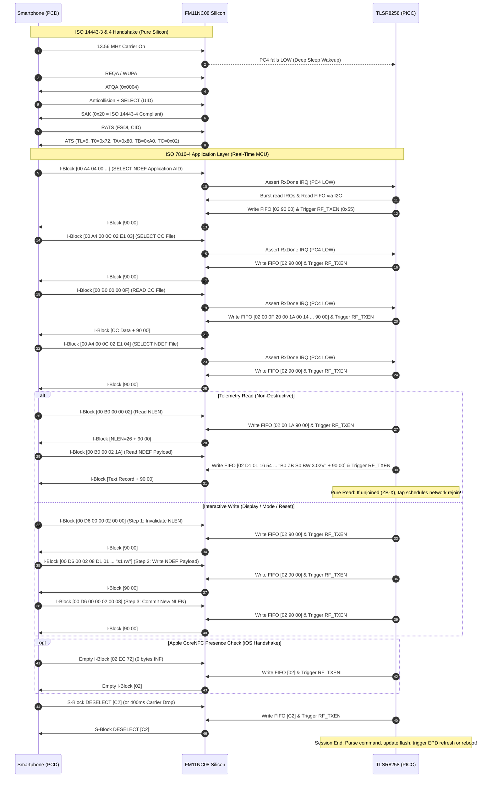

# FM11NC08 NFC Subsystem — Architecture, Pipeline & Dual-Stack Engineering Reference

This document is the authoritative engineering reference for the Near Field Communication (NFC) subsystem on the Hanshow Stellar-M3N@ / E31HA Electronic Shelf Label (ESL). It covers the high-level system architecture, the exact division of labor between the NFC tag controller and the host MCU, the over-the-air APDU message exchange pipeline, power-gated low-power integration, and the critical device-specific learnings required for robust cross-platform smartphone interaction (Android & iOS).

---

## 1. System Overview

The ESL tag integrates a **Telink TLSR8258** 32-bit multi-standard wireless SoC connected to a **Fudan Micro FM11NC08** dual-interface NFC tag controller.

```
┌─────────────────────────────────────────────────────────────┐
│                     Smartphone (PCD)                        │
│             Android (NFC Tools) / iOS (CoreNFC)             │
└──────────────────────────────┬──────────────────────────────┘
                               │
                       13.56 MHz RF Field
                               │
┌──────────────────────────────▼──────────────────────────────┐
│             Fudan Micro FM11NC08 NFC Controller             │
│  - Analog RF Frontend & Energy Harvester                    │
│  - ISO 14443-3 Type A Anticollision (ATQA, UID, SAK)        │
│  - ISO 14443-4 RATS / ATS Negotiation (Silicon ROM)        │
│  - 32-byte Hardware FIFO (0xFFF0)                           │
└──────────────┬──────────────────────────────▲───────────────┘
               │ PC4 (NFC_IRQ) Active-Low     │ PC6 (NFC_CS)
               │ (Level-Low Sleep Wakeup)     │ Active-Low Power Gate
               ▼                              │
┌─────────────────────────────────────────────┴───────────────┐
│               Telink TLSR8258 Host MCU (PICC)               │
│  - Dual-Stack Runtime: Zigbee 3.0 SED & BLE 5.0 BTHome V2   │
│  - Real-Time APDU Engine (src/nfc_fm11nc08.c)               │
│  - Hardware I2C Master @ 400 kHz Fast Mode (PC0/PC1)        │
│  - Type 4 Tag State Machine & Dynamic NDEF Telemetry Model  │
│  - Dual-Stack Command Dispatcher (Slot/Style/Mode/Zigbee)   │
│  - Non-Blocking E-Paper Controller (UC8151/IL0373 BWR 2.13")│
│  - Wear-Leveled Flash Settings (flash_eep.c)                │
└─────────────────────────────────────────────────────────────┘
```

### 1.1 Pin Connections & Hardware Interface

| Pin | Net | Function | Role | Electrical Behavior |
| :--- | :--- | :--- | :--- | :--- |
| `PC0` | `GPIO_NFC_SDA` | I2C Data | Hardware I2C group `C0C1` | Open-drain, external 4.7k pull-up to VDD |
| `PC1` | `GPIO_NFC_SCL` | I2C Clock | Hardware I2C group `C0C1` | Fast Mode @ 400 kHz (`CLOCK_SYS_CLOCK_HZ / (4 * 400000)`) |
| `PC4` | `GPIO_NFC_IRQ` | Interrupt / Field Detect | Tag output -> MCU input | Open-drain active-low; wakes MCU from deep retention sleep on `RxDone` |
| `PC6` | `GPIO_NFC_CS` | Chip Select / Power Gate | MCU output -> Tag input | Active-low; **must remain HIGH in idle** for RF frontend operation |
| `PB1` | `GPIO_UART_TX` | Debug UART | MCU output | 115,200 baud serial diagnostic output (active when `DEBUG = 1`) |
| `PA7` | `GPIO_LED_BLUE` | Status LED | BLE indication | Active-low; blinks blue when switching to or booting in BLE mode |
| `PD3` | `GPIO_LED_GREEN`| Status LED | Zigbee / NFC indication | Active-low; solid on during active NFC session; blinks green on Zigbee boot |
| `PD2` | `GPIO_LED_RED`  | Status LED | Error indication | Active-low; 3 blinks indicate I2C communication failure |

> [!IMPORTANT]
> NFC field detection via `PC4` is the **sole physical interaction and external wakeup mechanism** on the ESL.

### 1.2 LED Status Feedback Summary

| Pattern | Color | Subsystem / Event | Meaning |
| :--- | :--- | :--- | :--- |
| 2 short blinks (80 ms) | Green | NFC Initialization | Cold-boot I2C probe successful and registers configured |
| 3 long blinks (150 ms) | Red | NFC Initialization | Cold-boot I2C failure; chip did not acknowledge probe |
| Solid ON | Green | NFC Active Session | Smartphone RF carrier present and APDU session open |
| 1 pulse (100–200 ms) | Blue | BLE Mode | System booted or transitioned into BLE 5.0 BTHome mode |
| 1 pulse (100–200 ms) | Green | Zigbee Mode | System booted or transitioned into Zigbee 3.0 mode |
| 5 rapid flashes (60 ms) | Green | Zigbee Factory Reset | Flash cleared, NVRAM reset, rebooting into Zigbee pairing mode |

### 1.3 Subsystem Responsibilities

1. **Non-Destructive Dual-Stack Telemetry Read:** Tapping with any smartphone displays a standard NFC Forum NDEF Text Record containing the active firmware bank, protocol mode, network connection state, display slot, render style, and calibrated battery voltage (e.g. `B0 ZB S0 BW 3.02V`). Reading telemetry does **not** trigger an e-paper refresh, conserving coin-cell battery life.
2. **Interactive Multi-Function Write Dispatcher:**
   - **Display Control:** Writing `"s2 rw"`, `"slot:2 style:3"`, `"display:2,3"`, or `"2,3"` updates the active slot (0..7) and render style (0..4), saves non-volatile settings, refreshes the EPD, and broadcasts updated attributes over Zigbee/BLE.
   - **Mode Switching:** Writing `"zigbee"` or `"ble"` switches the operating stack, renders the Info screen (Slot 0), and reboots the MCU into the target protocol.
   - **Zigbee Factory Reset & Commissioning:** Writing `"zigbee:reset"` or `"zb:reset"` wipes network association credentials, restores factory-new state, and reboots into active Zigbee pairing mode.
3. **Field-Initiated Tap-to-Rejoin:** If a commissioned Zigbee tag loses its parent router (state `ZB-X`), simply tapping the tag with a phone (a read-only operation) immediately triggers a network rejoin attempt (`zb_start_rejoin()`), rate-limited to once every 5 seconds.
4. **Event-Gated Low-Power Wakeup:** Detection of a smartphone's 13.56 MHz carrier asserts `PC4` LOW, waking the MCU from deep retention sleep within microseconds. Conversely, during routine 2.0-second network polling wakes, the NFC peripheral is completely bypassed to eliminate redundant I2C bus current.

---

## 2. High-Level NFC Pipeline: Division of Labor

The FM11NC08 operates in **Level-4 NC (Channel) Mode** rather than passive EEPROM emulation (NT mode). In this mode, responsibilities are cleanly divided between hardware silicon and firmware.

```
               Contactless 13.56 MHz RF Interface
                              │
  ┌───────────────────────────┴───────────────────────────┐
  │         FM11NC08 Hardware Silicon (Autonomous)        │
  │  - ISO/IEC 14443-3 Type A Anticollision (ATQA/UID/SAK)│
  │  - ISO/IEC 14443-4 RATS / ATS Negotiation (EEPROM)   │
  │  - CRC-A Calculation, Append & Checksum Verification  │
  │  - 32-Byte Bidirectional Data FIFO Buffering          │
  └───────────────────────────┬───────────────────────────┘
                              │
                    I2C Master Bus + PC4 IRQ
                              │
  ┌───────────────────────────┴───────────────────────────┐
  │         Telink TLSR8258 MCU Firmware Engine           │
  │  - ISO/IEC 14443-4 Half-Duplex Block Framing (I/R/S) │
  │  - Apple CoreNFC Empty I-Block Presence Handshake     │
  │  - ISO/IEC 7816-4 APDU Execution (SELECT, READ, WRITE)│
  │  - NFC Forum Type 4 Tag File System (CC & NDEF)       │
  │  - Dual-Stack Telemetry Formatter & Command Parser    │
  │  - Power Gating & Event-Driven Sleep Control          │
  └───────────────────────────────────────────────────────┘
```

### 2.1 What the FM11NC08 Silicon Handles Autonomously

The host MCU is completely uninvolved in the lower ISO 14443 layers:

- **Analog RF Modulation & Demodulation:** 13.56 MHz carrier reception and 106 kbps Manchester / modified Miller subcarrier load modulation.
- **ISO/IEC 14443-3 Type A Initialization & Anticollision:** Responding to `REQA`/`WUPA` with `ATQA` (`0x0004`), performing cascade level 1 & 2 anticollision with UID, and acknowledging `SELECT` with `SAK` (`0x20` = ISO 14443-4 compliant).
- **ISO/IEC 14443-4 RATS / ATS Negotiation:** When the smartphone issues a Request for Answer to Select (`RATS`), the FM11NC08 hardware ROM reads configuration bytes directly from internal EEPROM (`0x03B0..0x03B6`) and transmits the `ATS` frame autonomously without interrupting or waking the MCU.
- **CRC Calculation & Epilogue Verification:** Automatically calculates and appends the 16-bit CRC-A on over-the-air transmission, and verifies/strips incoming CRC bytes before placing data into the FIFO.
- **32-Byte FIFO Buffering:** Stages inbound RF frames for I2C readout and outbound frames for RF transmission.

### 2.2 What the TLSR8258 MCU Manages in Real Time

The host MCU acts as the smart ISO 7816-4 APDU coprocessor:

- **ISO/IEC 14443-4 Half-Duplex Block Protocol:** Parses PCB bytes for I-blocks (with or without CID), S-blocks (`DESELECT`), and R-blocks (`ACK`/`NAK`).
- **PCD Presence-Check Handshake:** Detects and immediately answers ISO 14443-4 Empty I-blocks issued by Apple CoreNFC.
- **ISO/IEC 7816-4 APDU Execution:** Decodes CLA, INS, P1, P2 and routes commands (`SELECT AID`, `SELECT CC`, `READ BINARY CC`, `SELECT NDEF`, `READ BINARY NDEF`, `UPDATE BINARY NDEF`).
- **NFC Forum Type 4 Tag File System:** Maintains in-memory Capability Container (CC file `0xE103`) and dynamic NDEF file (`0xE104`).
- **Multi-Command Parsing & Execution:** Decodes structured commands (`NFC_CMD_SET_DISPLAY`, `NFC_CMD_SWITCH_ZIGBEE`, `NFC_CMD_SWITCH_BLE`, `NFC_CMD_ZIGBEE_RESET`).
- **Session Lifecycle & Sleep Gating:** Monitors transaction start, 400 ms inactivity timeouts, and DESELECT frames to transition the system safely into and out of deep retention sleep.

---

## 3. Over-the-Air Message Exchange Pipeline



---

## 4. NDEF Telemetry & Dual-Stack Command Specification

### 4.1 Telemetry String Data Model

When tapped by a smartphone, the ESL returns an NFC Forum Type 4 Tag NDEF Text Record generated dynamically in upper SRAM by `app_update_nfc_telemetry()`:

```
Boot: 0
Mode: Zigbee
Slot: 0
Style: Standard
Battery: 3.12V
Misc: wake up 10981 times, 39525ms, TX 11034ms, RX 21064ms
```

If a previous Over-the-Air (OTA) firmware upgrade failed, the `Boot` line indicates the error code and failing block:

```
Boot: 0 (Err 2#14)
Mode: Zigbee (pairing)
Slot: 0
Style: Standard
Battery: 3.00V
Misc: wake up 12 times, 45ms, TX 10ms, RX 21ms
```

#### Telemetry Fields Breakdown

| Field | Values | Description |
| :--- | :--- | :--- |
| **Boot** | `0` / `1` | Active boot bank (`mcuBootAddrGet() == 0 ? 0 : 1`). `0` = base firmware @ `0x000000`, `1` = OTA bank @ `0x040000`. Optional `(Err E#B)` if OTA error occurred. |
| **Mode** | `BLE` | Running Bluetooth Low Energy 5.0 BTHome V2 advertising stack. |
| | `Zigbee` | Running Zigbee 3.0 stack and **currently joined** to a Zigbee coordinator. |
| | `Zigbee (lost)` | Running Zigbee 3.0 stack, **already commissioned**, but parent router/coordinator is lost. |
| | `Zigbee (pairing)` | Running Zigbee 3.0 stack in **factory new / active pairing** mode. |
| **Slot** | `0` .. `9` (M3Na) / `0` .. `5` (XL3Na) | Active display slot: `0` = Info Screen, `1`..`8` (M3Na) / `1`..`4` (XL3Na) = User Images, `9` (M3Na) / `5` (XL3Na) = Blank White. |
| **Style** | `Standard` | Standard Tri-Color (`STYLE_STANDARD`, 0) |
| | `Black & White` | Black & White Standard (`STYLE_BW_STANDARD`, 1) |
| | `Black & White Inverted` | Black & White Inverted (`STYLE_BW_INVERTED`, 2) |
| | `Red & White` | Red & White Standard (`STYLE_RW_STANDARD`, 3) |
| | `Red & White Inverted` | Red & White Inverted (`STYLE_RW_INVERTED`, 4) |
| **Battery** | `X.XXV` | Calibrated battery voltage measured via SAR ADC (e.g. `3.12V`, `2.85V`). |
| **Misc** | `wake up N times, Nms, TX Nms, RX Nms` | Live power statistics from `power_tracker`: total wakeups, active awake time (ms), TX time (ms), and RX time (ms). |

> [!NOTE]
> The telemetry string supports up to 256 characters. Smartphones automatically chunk the multi-line record across sequential 26-byte `READ BINARY` slices ($MLe = 26$).

---

### 4.2 Interactive Smartphone Command Parsing

When an NFC write is committed, the firmware extracts the text payload from the NDEF record and routes it through `nfc_parse_written_ndef()` into an `nfc_cmd_t` structure.

```c
typedef enum {
    NFC_CMD_NONE = 0,
    NFC_CMD_SET_DISPLAY,    // update slot and/or style
    NFC_CMD_SWITCH_ZIGBEE,  // switch to Zigbee mode
    NFC_CMD_SWITCH_BLE,     // switch to BLE mode
    NFC_CMD_ZIGBEE_RESET,   // reset Zigbee network and enter pairing mode
} nfc_cmd_type_t;

typedef struct {
    nfc_cmd_type_t type;
    uint8_t slot;   // 0..7, or 0xFF if unchanged
    uint8_t style;  // 0..4, or 0xFF if unchanged
} nfc_cmd_t;
```

#### Supported NFC Commands

| Intent | Command Syntax (Case-Insensitive) | Action Executed |
| :--- | :--- | :--- |
| **Zigbee Factory Reset & Pairing** | `zigbee:reset`<br>`zb:reset`<br>`reset:zigbee`<br>`zigbee reset`<br>`zb reset` | 1. 5 rapid Green flashes (60 ms)<br>2. Clears NVRAM and Zigbee credentials (`zb_resetDevice2FN`)<br>3. Sets mode to Zigbee, slot to `EPD_SLOT_INFO`<br>4. Refreshes EPD and reboots into Zigbee pairing mode |
| **Switch to Zigbee** | `zigbee`<br>`zb` | 1. If already in Zigbee mode: triggers pairing if unjoined, or 1 Green blink if joined<br>2. If transitioning from BLE: 1 Green blink (300 ms), saves mode to flash, refreshes EPD Slot 0, and reboots MCU into Zigbee runtime |
| **Switch to BLE** | `ble` | 1. If already in BLE mode: 1 Blue blink<br>2. If transitioning from Zigbee: 1 Blue blink (300 ms), saves mode to flash, refreshes EPD Slot 0, and reboots MCU into BLE runtime |
| **Set Slot & Style (Combined)** | `s2 rw`<br>`s2 bwi`<br>`slot:2 style:3`<br>`slot:2,style:rw`<br>`style:3,slot:0`<br>`2,3` / `2:3`<br>`display:2,3` / `set:2,3` | Sets both slot (0..9 on M3Na, 0..5 on XL3Na) and style (0..4) simultaneously in one write. Updates flash, refreshes EPD, updates NFC telemetry, and reports attributes to Zigbee/BLE. |
| **Set Slot Only** | `s0` .. `s9` (M3Na) / `s0` .. `s5` (XL3Na)<br>`slot:2`<br>`slot=3`<br>`2` | Updates active slot while preserving current render style. |
| **Set Style Only** | `std`, `bw`, `bwi`, `rw`, `rwi`<br>`style:0` .. `style:4`<br>`style:rw` | Updates render style (0..4: 0=std, 1=bw, 2=bwi, 3=rw, 4=rwi) while preserving current active slot. |
| **Fallback / Next Slot** | Any unrecognized text (e.g. `next`, `step`, empty text) | Cycles sequentially to the next slot: `(active_slot + 1) % EPD_SLOT_COUNT`. |

> [!WARNING]
> **Deprecated Toggle Commands:** The keywords `"switch"` and `"toggle"` are explicitly ignored and filtered out to prevent ambiguous state toggles when operating in the field.

#### Telemetry Echo Suppression / Anti-Loop Filter

Many smartphone NFC apps (including NFC Tools) provide a "Read and Re-write" feature or inadvertently write back the read content. To prevent telemetry readbacks from triggering unintended screen refreshes, the parser ignores any string matching:
- Text beginning with `[` followed by `Z`, `B`, `z`, or `b` (e.g. `[ZB...]`)
- Text prefixed with `b0 `, `b1 `, `zb `, `ble `, `zb-x `, or `zb-p `

---

### 4.3 Field-Initiated Tap-to-Rejoin (ZB-X Recovery)

When an ESL is configured for Zigbee operation but cannot communicate with its coordinator/router (status `ZB-X`), it enters an energy-conserving backoff sleep. 

To restore network connectivity without tools, the firmware incorporates **Tap-to-Rejoin**:
- When a user taps the tag with a smartphone, the tag wakes to service the standard NFC telemetry read.
- In `nfc_process_events()`, the firmware detects that `settings.active_mode == DEVICE_MODE_ZIGBEE` and the device is unjoined (`!zb_isDeviceJoinedNwk() && !zb_isDeviceFactoryNew()`).
- The tag immediately schedules a network rejoin attempt (`zb_start_rejoin()`), rate-limited to once every 5 seconds.
- **No write command is required** — any smartphone read tap reconnects an offline tag!

---

## 5. Low-Power Architecture & Event-Gated NFC Operation

To achieve multi-year coin cell longevity, the firmware eliminates unnecessary I2C bus traffic during deep sleep retention cycles:

1. **Continuous VDD Power:** On the Hanshow Stellar PCB, the FM11NC08 is continuously powered from the 3.0V battery rail. When the TLSR8258 enters deep retention sleep, the FM11NC08 remains powered and **retains all of its internal configuration and interrupt mask registers**.
2. **Zero-Overhead Retention Wakeup:** Because register configuration is retained by the FM11NC08 across sleep cycles, retention wakeups execute zero I2C transactions.
3. **Hardware Event Gating (`GPIO_NFC_IRQ` / `PC4`):** In `main.c`, NFC servicing is strictly gated by the physical state of the interrupt pin:

```c
// Event-gated NFC: only initialize I2C / process NFC if RF field is detected
if (!gpio_read(GPIO_NFC_IRQ)) {
    nfc_fm11nc08_init(false);
}

// In main loop (both BLE and Zigbee):
if (!gpio_read(GPIO_NFC_IRQ) || nfc_fm11nc08_is_active()) {
    nfc_process_events();
}
```

During 99.99% of retention wakeups (routine 2.0-second timer polling), `GPIO_NFC_IRQ` (`PC4`) is HIGH. The MCU leaves the I2C peripheral completely unclocked, checks its radio queue, and returns to deep sleep in under $1.5\text{ ms}$.

### 5.3 Sleep Gating During Active Transactions

To prevent the MCU from dropping into deep retention sleep midway through an APDU exchange, both network power managers gate low-power sleep:

- **BLE Stack (`ble_pm_task`):**
  ```c
  if (!nfc_fm11nc08_is_active() && gpio_read(GPIO_NFC_IRQ)) {
      cpu_set_gpio_wakeup(GPIO_NFC_IRQ, Level_Low, 1);
      bls_pm_setSuspendMask(SUSPEND_ADV | DEEPSLEEP_RETENTION_ADV |
                            SUSPEND_CONN | DEEPSLEEP_RETENTION_CONN);
  } else {
      bls_pm_setSuspendMask(SUSPEND_DISABLE);
  }
  ```
- **Zigbee Stack (`zb_pm_task`):**
  ```c
  if (zb_is_pairing() || zb_is_interviewing() || 
      nfc_fm11nc08_is_active() || !gpio_read(GPIO_NFC_IRQ)) {
      return; // Inhibit sleep
  }
  ```

`nfc_fm11nc08_is_active()` returns `true` whenever an APDU session is open (`session_active`) or `PC4` is LOW. Sleep is only re-enabled after an S-block DESELECT frame or a 400 ms RF carrier drop.

---

## 6. Critical Device-Specific Learnings & Engineering Traps

This section documents the subtle hardware characteristics, race conditions, and smartphone baseband quirks identified and solved during development.

### 6.1 Chip Select (`PC6` / `NFC_CS`) Framing & Power Gating

- **Trap:** On the FM11NC08, `NFC_CS` is not an ordinary SPI/I2C peripheral select — it functions as an internal **power gate between the contact (I2C) and contactless (RF) interfaces**. Holding CS LOW forces the internal silicon state machine into contact mode and **completely disables the 13.56 MHz RF analog frontend**.
- **Rule:** `PC6` must stay **HIGH during idle** and **HIGH during RF load modulation**.
- **Framing:** The silicon die multiplexes decode logic between SPI and I2C. If CS is kept LOW across separate I2C operations (e.g. read IRQ, then write TXEN), the chip fails to detect subsequent START conditions and misinterprets register writes as FIFO data.
- **Fix:** Every low-level hardware function (`nfc_read_fifo`, `nfc_write_fifo`, `nfc_flush_fifo`, `nfc_read_irqs`) strictly asserts CS LOW, performs the I2C burst, and immediately restores CS HIGH.

### 6.2 The 32-Byte Hardware FIFO Constraint & Multi-Read Slicing

- **Constraint:** The FM11NC08 has a fixed **32-byte hardware FIFO**. Multi-frame chaining under ISO 14443-4 adds substantial protocol overhead and latency.
- **Mathematical Framing Limits:** All individual over-the-air frame slices are strictly designed to fit within 32 bytes:
  - **Capability Container (CC) File:** Advertises $MLe = 26$ (`0x001A`) and $MLc = 20$ (`0x0014`), with maximum NDEF file size of 384 bytes (`0x0180`).
  - **Max Read Frame:** 1 PCB + 1 CID + 26 data + 2 SW1/SW2 = **30 bytes** $\le 32$.
  - **Max Write Frame:** 1 PCB + 1 CID + 5 APDU header + 20 data = **27 bytes** $\le 32$.
  - **NDEF Multi-Read Slicing:** When returning text payloads up to 256 bytes (total NDEF record size up to ~270 bytes), smartphone NFC stacks automatically issue consecutive `READ BINARY` APDUs at offsets `0x0002`, `0x001C`, `0x0036`, etc. The APDU engine slices the `t4t_ndef_file` in `.custom_bss` into 26-byte segments in real time without overflowing the 32-byte hardware FIFO.

### 6.3 Smartphone Turnaround Discrepancy & Zero-Latency TX Return

- **Symptom:** Android read/write worked reliably, but Apple iPhone CoreNFC consistently failed with write errors and retransmission loops (`524E` = `R(NAK)`).
- **Root Cause:**
  - Android software NFC stacks have an inter-APDU turnaround time of **$\ge 5\text{ ms}$**.
  - Apple iPhone CoreNFC executes in hardware baseband with an ultra-fast turnaround time of **$\approx 1.5\text{ ms}$**.
  - Over-the-air RF transmission of a short response (`02 90 00`) takes only **$0.47\text{ ms}$**.
  - Previous firmware executed `WaitMs(4)` followed by an I2C read of `MAIN_IRQ`. By $t = 1.5\text{ ms}$, the iPhone had already transmitted the next APDU, asserting `RxDone`. When the MCU woke at $4\text{ ms}$ and read `MAIN_IRQ`, it **cleared the pending `RxDone` interrupt**, dropping the iPhone's command. The iPhone timed out, sent `R(NAK)`, hit the same trap, and aborted.
- **Fix:** Remove all delays, remove `RF_TXEN = 0x00`, and remove post-TX IRQ reading. Once `RF_TXEN = 0x55` is written, the MCU returns immediately to the polling loop with the I2C bus 100% silent.

### 6.4 Apple CoreNFC Empty I-Block Presence Check

- **Symptom:** An iOS write transaction completed all 3 `UPDATE BINARY` commands (`WR:3`), but NFC Tools reported a write error.
- **Discovery:** At the end of write transactions, Apple CoreNFC transmits an **ISO 14443-4 Empty I-block** (`RX[3]: 02 EC 72` or `03 65 63` — 1 byte PCB, 0 bytes INF, 2 bytes CRC) as a presence check.
- **Fix:** When an incoming I-block has `apdu_len == 0`, the tag must immediately echo an Empty I-block with the matching block number (`0x02 | block_num`). Acknowledging this presence check allows Apple CoreNFC to complete the transaction and report success.

### 6.5 Single 3-Byte IRQ Burst Read & Masking

- **Latched Interrupts:** The FM11NC08 has three read-to-clear interrupt registers: `MAIN_IRQ` (`0xFFF7`), `FIFO_IRQ` (`0xFFF8`), and `AUX_IRQ` (`0xFFF9`). If any flag remains unread, `PC4` stays asserted LOW, blocking sleep entry and locking the MCU in a wake loop.
- **Burst Read:** Reading all three registers in a single contiguous 3-byte I2C read (`0xFFF7..0xFFF9`) clears all flags simultaneously in under $90\ \mu\text{s}$.
- **Masking:** `MAIN_IRQ_MASK` is set to `0xEF` (only `RxDone` bit 4 unmasked). `TxDone`, `FifoEmpty`, `Active`, and `RfPower` are masked so `PC4` asserts **only when a complete frame has arrived in the FIFO**.

### 6.6 EEPROM Layout at `0x03B0` (Contiguous ATS Map)

The FM11NC08 EEPROM block `0x03B0` has a non-obvious layout confirmed by the official SoloKeys Solo 2 driver:

```
EEPROM Address   Field        Target Value   Meaning
0x03B0           TL           0x05           ATS total length = 5 bytes
0x03B1           T0           0x72           Format byte: TA, TB, TC present; FSCI=2 (32B)
0x03B2           NFC_CFG      (preserved)    Silicon RF configuration register
0x03B3           I2C_ADDR     0xAE           I2C slave address byte (DO NOT OVERWRITE!)
0x03B4           TA           0x80           106 kbps in both directions
0x03B5           TB           0xA0           FWI=10 (~309 ms timeout), SFGI=0 (no guard time)
0x03B6           TC           0x02           CID supported, NAD not supported
```

> [!CAUTION]
> **Never perform a contiguous write across `0x03B0..0x03B6`.** Bytes `0x03B2` and `0x03B3` contain the chip's internal RF configuration and I2C slave address. The chip's RATS ROM autonomously skips `0x03B2..0x03B3` when serving the ATS frame. Firmware writes `0x03B0..0x03B1` (2 bytes) and `0x03B4..0x03B6` (3 bytes) as two separate transactions.

### 6.7 First-Come-First-Served (FCFS) Arbitration

- **Register:** `USER_CFG2` (`0xFFE2` / EEPROM `0x0392`) must be set to `0x98` (bits[5:4] = `01` FCFS mode + bits[3:0] = `0x8` never-sleep).
- **Reason:** Contact-first priority (`0x01`) allows I2C transfers to abort active over-the-air RF load modulation, causing CRC failures on smartphones. FCFS prevents the MCU from clobbering active RF transmissions.

### 6.8 Retention SRAM Requirements on TLSR8258

- In deep retention sleep (`DEEPSLEEP_MODE_RET_SRAM_LOW32K`), only the lower 32 KB of SRAM is preserved. Standard `.bss` and `.data` variables located in upper SRAM are zeroed upon wakeup.
- All state variables that must survive sleep cycles (`fm11_present`, `session_active`, `settings`, `nfc_diag`) MUST be qualified with `RAM` (`_attribute_data_retention_`) or placed in `.custom_bss` to ensure placement in lower retention SRAM.

---

## 7. Register & Memory Reference

### 7.1 System Registers (`0xFFxx`)

| Address | Name | Access | Value Used | Key Bits / Function |
| :---: | :--- | :---: | :---: | :--- |
| `0xFFE0` | `USER_CFG0` | R/W | `0x91` | Mode: NC Channel mode, VOUT on, IRQ open-drain active-low |
| `0xFFE1` | `USER_CFG1` | R/W | `0x82` | Protocol: RF inventory enabled, ISO 14443-4 active |
| `0xFFE2` | `USER_CFG2` | R/W | `0x98` | Arbitration: FCFS arbitration, RF protected |
| `0xFFE6` | `RESET_SILENCE`| W | `0x55` / `0xCC` | `0x55` = soft reset; `0xCC` = force contactless RF active |
| `0xFFE7` | `STATUS` | R | Dynamic | Chip status; bit 0 = `user_cfg_chk_flag` (1 if checksum valid) |
| `0xFFF0` | `FIFO_ACCESS` | R/W | — | 32-byte bidirectional data FIFO |
| `0xFFF1` | `FIFO_CLEAR` | W | `0xFF` | Flush FIFO write buffer |
| `0xFFF2` | `FIFO_WORDCNT`| R | Dynamic | Current bytes available in FIFO (0..32) |
| `0xFFF3` | `RF_STATUS` | R | Dynamic | RF link state; bit 0 = carrier detected |
| `0xFFF4` | `RF_TXEN` | W | `0x55` | Transmit FIFO data over RF with autonomous CRC16 |
| `0xFFF7` | `MAIN_IRQ` | R (Clear) | Dynamic | bit 4 = `RxDone`, bit 3 = `TxDone`, bit 6 = `Active` |
| `0xFFF8` | `FIFO_IRQ` | R (Clear) | Dynamic | bit 2 = `OverFlow`, bit 0 = `Empty` |
| `0xFFF9` | `AUX_IRQ` | R (Clear) | Dynamic | bit 7 = `EE_Prog_Done`, bit 6 = `EE_Prog_Err` |
| `0xFFFA` | `MAIN_IRQ_MASK`| R/W | `0xEF` | Unmasks `RxDone` only (bit 4 = 0) |
| `0xFFFB` | `FIFO_IRQ_MASK`| R/W | `0xFF` | All FIFO interrupts masked |
| `0xFFFC` | `AUX_IRQ_MASK` | R/W | `0xFF` | All auxiliary interrupts masked |

---

## 8. Diagnostic & Testing Infrastructure

The firmware provides multi-layered diagnostic instrumentation to inspect the NFC subsystem in production and lab environments:

### 8.1 In-Memory Diagnostic Snapshot

The `nfc_diag_data_t` structure maintains live operational metrics:

```c
typedef struct {
    uint8_t  present;           // 1 if chip ACKed I2C, 0 otherwise
    uint8_t  i2c_addr;          // 0xAE, 0xA0, etc.
    uint8_t  vendor_id;         // Hardware vendor ID from EEPROM 0x0000
    uint8_t  irq_pin_level;     // Current digital level of PC4
    uint16_t irq_fall_count;    // Total falling edge transitions on PC4
    uint8_t  user_cfg[4];       // USER_CFG0..3 readback
    uint8_t  ats_tl_t0[2];      // ATS TL and T0 configuration
    uint8_t  ats_ta_tc[3];      // ATS TA, TB, and TC configuration
    uint8_t  status_reg;        // STATUS register (0xFFE7)
    uint8_t  reg_user_cfg0;     // Runtime USER_CFG0 register (0xFFE0)
    uint8_t  rf_status_reg;     // RF_STATUS register (0xFFF3)
    uint8_t  reg_main_irq_mask; // MAIN_IRQ_MASK register (0xFFFA)
    uint8_t  last_main_irq;     // Last read MAIN_IRQ (0xFFF7)
    uint8_t  last_fifo_wordcnt; // Last FIFO byte count
    uint8_t  last_fifo_irq;     // Last read FIFO_IRQ (0xFFF8)
    uint8_t  last_aux_irq;      // Last read AUX_IRQ (0xFFF9)
    uint8_t  last_rx_len;       // Last received frame byte count
    uint8_t  last_rx_bytes[16]; // First 16 bytes of last received frame
    uint8_t  last_tx_len;       // Last transmitted frame byte count
    uint8_t  last_tx_bytes[8];  // First 8 bytes of last transmitted frame
    uint16_t session_count;     // Total completed NFC sessions
    uint16_t apdu_count;        // Total APDUs executed
    uint16_t write_count;       // Total writes processed
} nfc_diag_data_t;
```

### 8.2 Formatted Diagnostic String

`nfc_fm11nc08_get_diag_string()` formats the snapshot into a compact ASCII string:

```
FM11:OK(0xAE,v10) PC4:1(ev:14) CFG:91829874 ST:01 RF:01 IRQ:10 W:7 F:00 A:00 S:2 AP:8 WR:2 RX[7]:0200A400 TX:029000 [0]A4>9000 [1]B0>9000
```

### 8.3 On-Screen System Diagnostics (EPD Slot 0)

Writing `"s0"` or setting the active slot to 0 renders the **System Info Screen** directly onto the 2.13" BWR E-Paper display:
- Displays active protocol (`ZIGBEE 3.0 (2s poll)` vs `BLUETOOTH LE (BTHome)`)
- Current render style (`B&W std`, `B&W inv`, `R&W std`, `R&W inv`)
- BLE/Zigbee Public MAC Address
- Calibrated battery voltage, percentage, and ambient temperature
- Total lifetime screen refresh count
