# TLSR8359 / TLSR8258 Factory Firmware Analysis: HS_Stellar_M3Na_E31HA (Hanshow Stellar-M3N@ / E31HA Electronic Shelf Label)

## 1. Executive Summary & Device Identification

This document provides a comprehensive technical reverse engineering, architecture analysis, and hardware specification reference for the authentic factory stock firmware dumped from a **TLSR8359 / TLSR8258** microcontroller:
* **Firmware Dump Path:** `original_firmware/HS_Stellar_M3Na_E31HA.bin`
* **File Size:** `524,288 bytes` (512 KB SPI Flash dump)
* **Target Hardware:** **Hanshow Stellar-M3N@ / Stellar-MN@ E31HA Electronic Shelf Label (ESL)** (Model: **E31HA** / **E31H**, 2.13-inch 3-Color E-Paper Display)
* **OEM Manufacturer:** Beijing Hanshow Technology Co., Ltd. (北京汉朔科技有限公司 / `hanshow.com`)
* **NDEF Broadcast Identity:** **`汉朔科技E31`** (Hanshow Technology E31, encoded as NFC NDEF Text Record at Flash `0x02523A`)
* **Silicon Platform:** Telink **TLSR8359 / TLSR8258** (Silicon Platform: **B85**, Chip ID: `0x5562`, Silicon Rev: `0x02`, 32-bit TC32 RISC Core @ 24/48 MHz, 64 KB SRAM with 32 KB Retention SRAM)
* **Internal SPI Flash:** Puya Semiconductor **P25Q40H / P25D40H** series (JEDEC ID: `0x856013`, 512 KB capacity)
* **Flash Status Register:** `0x2C` (Status: `READY`, Block Protection: `BP=3`, memory blocks write-protected in factory state)
* **Factory IEEE / BLE MAC Address:** **`48:A0:6D:F0:06:AB`** (located at Flash `0x01F000`, Little-Endian raw bytes: `AB 06 F0 6D A0 48`, OUI `48:A0:6D` registered to **Telink Semiconductor (Shanghai) Co., Ltd.**)
* **ESL Barcode / Serial Number IDs:** **`095146231463444196`** (18-digit) and **`0951461463444196`** (16-digit) (located at Flash `0x00C21C` and `0x07D01C`)
* **Display Hardware:** $2.13''$ 3-Color (Black, White, Red) Active Matrix Electrophoretic Display (AMEPD), $250\times 122$ pixel resolution, driven by an UltraChip **UC8151** (also compatible with **IL0373** / **SSD1619**) controller IC
* **NFC Transceiver:** Fudan Microelectronics **FM11NC08** $I^2C$ NFC Tag IC with pre-configured NDEF record
* **Magnetic Sensor:** Proximity Reed Switch on `PA0` (Magnet proximity wake-up and activation, tested by `init reed` routine at `0x024B5C`)
* **Firmware Architecture:** Multi-Stage Boot System:
  * **Stage 1 (Flash `0x00000`–`0x09730`):** Telink SWS / Hardware Bootloader (`_bin_size_ = 0x9730` / 38,704 bytes)
  * **Stage 2 (Flash `0x0D000`–`0x252B0`):** Main Hanshow ESL Application (`"hanshow day day up!!!"`, proprietary 2.4 GHz RF star protocol stack, EPD graphics engine, NFC handler)
  * **EPD Execution Overlay (Flash `0x3D000`–`0x3F000`):** High-speed TC32 display waveform and SPI transfer engine (3,981 bytes)
  * **EPD Descriptors & Jump Table (Flash `0x3F000`–`0x3F640`):** Function dispatch table and waveform parameter tables
  * **Active Screen Buffer (Flash `0x46000`–`0x47000`):** 4 KB active monochrome display bitmap
* **Acquisition Interface:** Hardware SWS (Single-Wire Slave) on GPIO `PA7` via USB-UART SWS Programmer (e.g. `TLSR825xComFlasher.py` / `TlsrComSwireWriter`)

```mermaid
graph TD
    subgraph Silicon ["TLSR8359 / TLSR8258 Silicon Subsystem (QFN32)"]
        CPU["32-bit TC32 RISC Core @ 24/48 MHz"]
        SRAM["64 KB Internal SRAM<br>(32 KB Retention SRAM + 32 KB Extended SRAM)"]
        FLASH["512 KB Internal SPI NOR Flash<br>(Puya P25Q40H 0x856013)"]
        RF["2.4 GHz Multi-Standard RF Transceiver<br>(Hanshow Proprietary 2.4G Protocol)"]
        SWS["SWS Single-Wire Slave (GPIO_PA7)<br>Shared with Blue LED"]
    end

    subgraph Firmware ["Factory Firmware Architecture (HS_Stellar_M3Na_E31HA.bin)"]
        BOOT["Stage 1 Bootloader (0x00000 - 0x09730)<br>Vector Header & cstartup<br>Load Size: 11,264 B | BinSize: 38,704 B"]
        ESL_CFG["ESL Barcode & Config Mirror (0x0C000 / 0x7D000)<br>Barcode: 095146231463444196<br>Config: '1095' | Time: 0x54A34122"]
        APP["Stage 2 Main ESL Application (0x0D000 - 0x252B0)<br>Hanshow 2.4GHz Star Protocol Engine<br>Debug: 'hanshow day day up!!!'<br>NDEF NFC Record: '汉朔科技E31'"]
        MAC_SEC["Factory Public MAC Sector (0x01F000)<br>MAC: 48:A0:6D:F0:06:AB<br>Legacy 128KB Boundary Placement"]
        EPD_CODE["EPD High-Speed Execution Overlay (0x3D000 - 0x3F000)<br>TC32 Fast Waveform Engine (3,981 B)"]
        EPD_DESC["EPD Function Jump Table & Descriptors (0x3F000 - 0x3F640)"]
        EPD_BUF["Active Screen Buffer (0x46000 - 0x47000)<br>250x122 1-bit Monochrome Screen Image<br>Header: 00 03 D3 5F 02 01 00"]
        NVRAM["Hardware State & Sleep NVRAM (0x7B000 - 0x7C000)<br>Deep-sleep retention state"]
    end

    subgraph Hardware_IO ["External Peripherals & ESL Board Subsystems"]
        EPD["2.13'' 3-Color E-Paper Display (250x122)<br>Controller: UC8151 / IL0373 (90° Rotated Scanning)<br>SPI: PB4 (CS), PB5 (CLK), PB6 (MOSI)<br>Control: PD4 (RST), PD7 (DC), PA1 (BUSY: Low=Busy)<br>Power Switch: PC5 (Active-Low P-MOSFET)"]
        NFC["Fudan Micro FM11NC08 NFC IC<br>I2C: PC0 (SDA), PC1 (SCL)<br>Interrupt: PC4 (IRQ), CS: PC6"]
        REED["Magnetic Reed Switch (PA0 / Pull-Up)<br>Magnet Wakeup & Factory Activation ('init reed')"]
        LED["Status RGB LED Indicator<br>PD2 (Red), PD3 (Green), PA7 (Blue / SWS)"]
        VBAT["Battery Monitor (2x CR2450, 3.0V, 1200 mAh)<br>Internal SAR ADC via PB0 / VDD ('adc %dmV')"]
    end

    Silicon --> Firmware
    Firmware --> Hardware_IO
```



---

## 2. Firmware Binary Header & Checksums

### 2.1 File Hashes & Checksums
| Metric | Value | Verification Status |
| :--- | :--- | :--- |
| **Dump File Size** | 524,288 bytes (`0x080000`) | Exact 512 KB SPI Flash capacity |
| **Stage 1 (Bootloader) Size** | 38,704 bytes (`0x00009730` bytes) | Extracted from header `_bin_size_` at `0x00018` |
| **Stage 2 (Application) Size** | 98,992 bytes (`0x000182B0` bytes) | Extends from `0x00D000` to `0x0252B0` |
| **Overlay Code Size** | 3,981 bytes (`0x00000F8D` bytes) | Extends from `0x03D000` to `0x03DF8D` |
| **Active Screen Buffer** | 4,096 bytes (`0x00001000` bytes) | Sector `0x046000` to `0x047000` |
| **MD5 Hash (Entire 512KB Dump)** | `b243f2dd1a8774f713b5f672a9a47f1b` | Authentic verified dump |
| **SHA1 Hash (Entire 512KB Dump)** | `c45db037091d6903ab0d0856bec3847f84e89f45` | Authentic verified dump |
| **SHA256 Hash (Entire 512KB Dump)** | `6ce72da4cdc42bd98fee04a3d2ba1eba0fea1ebfca08f4e30b2e270a19a10211` | Authentic verified dump |

### 2.2 Stage 1 Bootloader Vector Header (`0x00000000` - `0x00000020`)
```text
Offset    Raw Bytes (Hex)              Decoded Field Description
-----------------------------------------------------------------------------------------
0x0000    28 80 00 00                  tj __reset (TC32 branch to reset entry 0x00B0)
0x0004    00 00 00 00                  FILE_VERSION / Magic Tag: 0x00000000
0x0008    4B 4E 4C 54                  Signature: 'TLNK' (0x544C4E4B in Little-Endian)
0x000C    00 0B 88 00                  _icload_size_div_16_: 0x00880B00 (Load size: 11,264 bytes)
0x0010    BE 80 00 00                  tj __irq (TC32 branch to interrupt vector)
0x0014    00 00                        MANUFACTURER_CODE: 0x0000
0x0016    00 00                        IMAGE_TYPE: 0x0000 (Bootloader / System Image)
0x0018    30 97 00 00                  _bin_size_: 0x00009730 (38,704 bytes, ends at 0x009730)
0x001C    00 00 00 00                  Reserved / Pad
```

### 2.3 Stage 2 Main Application Vector Header (`0x0000D000` - `0x0000D020`)
```text
Offset    Raw Bytes (Hex)              Decoded Field Description
-----------------------------------------------------------------------------------------
0x0D000   28 80 00 00                  tj __reset (TC32 branch to reset entry 0xD0B0)
0x0D004   00 00 00 00                  FILE_VERSION: 0x00000000
0x0D008   4B 4E 4C 54                  Signature: 'TLNK' (0x544C4E4B in Little-Endian)
0x0D00C   00 06 88 00                  _icload_size_div_16_: 0x00880600 (Load size: 6,144 bytes)
0x0D010   26 81 B4 82                  tj __irq (TC32 branch to application interrupt handler)
0x0D014   01 00                        MANUFACTURER_CODE: 0x0001 (Hanshow OEM Application)
0x0D016   00 D0                        IMAGE_TYPE: 0xD000 (App Bank 1 Vector Base)
0x0D018   00 00 00 60                  Application Memory Boundary & Segment Flags
0x0D01C   00 00 00 00                  Reserved / Pad
```

---

## 3. Flash Memory Map & Partition Table

The 512 KB SPI NOR flash layout of the authentic Hanshow Stellar-M3N@ / E31HA firmware dump:

| Flash Address Range | Size | Allocation / Partition Description | Status in Dump |
| :--- | :--- | :--- | :--- |
| `0x00000` – `0x09730` | 38.7 KB | **Stage 1 Bootloader & SWS Driver** (Reset vectors, cstartup, hardware init, recovery) | Active (38,704 bytes) |
| `0x09730` – `0x0AFF0` | ~6.2 KB | **Bootloader Padding & Free Space** | Blank (`0xFF`) |
| `0x0AFF0` – `0x0B000` | 16 B | **Bootloader Validation & Timestamp Marker** (`0x54B34122`, vector `0x29`) | Populated (8 bytes) |
| `0x0B000` – `0x0C000` | 4 KB | **Unallocated Space** | Blank (`0xFF`) |
| `0x0C000` – `0x0D000` | 4 KB | **ESL Working Configuration & Barcode Mirror Sector** (`"1095"`, Barcode String) | Populated (318 bytes) |
| `0x0D000` – `0x252B0` | ~96.7 KB | **Stage 2 Main ESL Application Firmware** (Hanshow 2.4G stack, EPD driver, NFC NDEF) | Active (98,992 bytes) |
| `0x1F000` – `0x20000` | 4 KB | **Factory Public IEEE MAC Address Sector** (MAC: `48:A0:6D:F0:06:AB` at `0x01F000`) | Populated |
| `0x252B0` – `0x3D000` | ~95.3 KB | **Application Staging Buffer / Zero-Cleared Partition** | Zero-Filled (`0x00`) |
| `0x3D000` – `0x3F000` | 8 KB | **High-Speed EPD Execution Overlay** (TC32 accelerated display refresh routines) | Active (3,981 bytes) |
| `0x3F000` – `0x3F640` | ~1.6 KB | **Function Jump Table & Vector Descriptors** (Dispatch table into `0x3D000` code) | Active (114 bytes) |
| `0x3F640` – `0x46000` | ~26.4 KB | **Unallocated / Free Flash Space** | Blank (`0xFF`) |
| `0x46000` – `0x47000` | 4 KB | **Current E-Paper Display Monochrome Bitmap Buffer** ($250\times 122$ 1-bit screen image) | Active (559 bytes non-0xFF) |
| `0x47000` – `0x76000` | 188 KB | **Unallocated / Free Space (Multi-Image Storage Slot)** | Blank (`0xFF`) |
| `0x76000` – `0x77000` | 4 KB | **Standard Telink 512K MAC Sector** (Unprogrammed in stock dump; legacy MAC is at `0x01F000`) | Blank (`0xFF`) |
| `0x77000` – `0x78000` | 4 KB | **Standard Telink Crystal Trim Sector** (Unprogrammed in stock dump) | Blank (`0xFF`) |
| `0x78000` – `0x7B000` | 12 KB | **Unallocated Space** | Blank (`0xFF`) |
| `0x7B000` – `0x7C000` | 4 KB | **Hardware State & Power Management NVRAM Sector** (Deep-sleep retention state) | Populated (128 bytes) |
| `0x7C000` – `0x7D000` | 4 KB | **Reserved Flash Space** | Blank (`0xFF`) |
| `0x7D000` – `0x7E000` | 4 KB | **Factory Master Calibration, Configuration & Barcode Master Sector** | Populated (242 bytes) |
| `0x7E000` – `0x7F000` | 4 KB | **Reserved Space** | Blank (`0xFF`) |
| `0x7F000` – `0x80000` | 4 KB | **Top Flash Identity & Flash Protection Status Flag** (`0x50` indicator) | Populated (1 byte) |

---

## 4. Factory Device Identity & Barcode Architecture

### 4.1 Factory IEEE MAC Address Placement (`0x01F000`)
A crucial architectural finding from reverse engineering the factory flash dump:
* In the stock dump, the 6-byte public MAC address is stored at **`0x01F000`** (offset 124 KB):
  ```text
  0x01F000:  AB 06 F0 6D A0 48 02 00 00 E8 84 00 9C 48 02 00  |...m.H.......H..|
  0x01F010:  FF 0F 00 00 98 48 02 00 18 07 C0 46 00 65 00 F6  |.....H.....F.e..|
  ```
* **Raw MAC Bytes (`0x01F000..0x01F005`):** `AB 06 F0 6D A0 48` (Telink Little-Endian byte order)
* **Canonical IEEE Representation:** **`48:A0:6D:F0:06:AB`**
* **IEEE OUI (`48:A0:6D`):** Registered to **Telink Semiconductor (Shanghai) Co., Ltd.**
* **Device Unique NIC:** `F0:06:AB`
* **Historical Rationale:** `0x01F000` corresponds to the top 4 KB sector of a **128 KB** memory space. In older Telink SDKs and early bootloaders designed for 128 KB or 256 KB flash chips, `0x01F000` was the default factory calibration sector. Although this hardware uses a 512 KB NOR flash, Hanshow's production line retained the legacy 128 KB sector address (`0x01F000`) rather than the standard 512 KB address (`0x76000`).

### 4.2 Factory Barcode & ESL Serial Numbers (`0x00C21C` & `0x07D01C`)
Mirroring between sector `0x0C000` (working runtime sector) and sector `0x7D000` (master factory sector) preserves the physical label identity printed on the Hanshow ESL back sticker:

```text
0x00C200:  47 60 52 56 78 53 57 CB 74 66 00 00 00 00 57 3A  |G`RVxSW.tf....W:|
0x00C210:  62 E4 97 97 97 56 22 41 A3 54 00 00 30 39 35 31  |b....V"A.T..0951|
0x00C220:  34 36 32 33 31 34 36 33 34 34 34 31 39 36 30 39  |4623146344419609|
0x00C230:  35 31 34 36 31 34 36 33 34 34 34 31 39 36 FF FF  |51461463444196..|
```

* **Primary Barcode (18 Digits):** **`095146231463444196`**
  * `095`: Hanshow product line prefix for Stellar 2.13-inch series.
  * `146`: Hardware model code corresponding to Stellar-M3N@ / E31HA.
  * `231463444196`: Device serial number and production sequence identifier.
* **Secondary / Short Barcode (16 Digits):** **`0951461463444196`**
* **Factory Calibration Timestamp (`0x0C216..0x0C219` & `0x7D016..0x7D019`):** `22 41 A3 54` (`0x54A34122`)
* **Factory Configuration Tag (`0x0C010..0x0C013`):** ASCII `"1095"`

---

## 5. Firmware Architecture & Runtime Subsystems

### 5.1 Linker Loader & Segment Copy Table (`0x0D1B0` - `0x0D200`)
The main application uses an internal segment scatter-loading mechanism to distribute functions across flash and SRAM during boot:

| Table Offset | Memory Target | Length | Purpose / Subsystem |
| :--- | :--- | :--- | :--- |
| `0x0D1B0` | `0x0000D000` | `0x0400` (1,024 B) | Application Vector Header & cstartup bootstrap |
| `0x0D1B8` | `0x0000D400` | `0x5C00` (23.5 KB) | Core RF Link Layer & Hanshow MAC Protocol Engine |
| `0x0D1C0` | `0x00013000` | `0x1C00` (7.1 KB) | Peripheral I/O, SPI, I2C, and UART Drivers |
| `0x0D1C8` | `0x00015000` | `0x3A000` (237 KB) | Flash Storage Management & Image Decompressor |
| `0x0D1EC` | **`0x0003D000`** | **`0x2000` (8,192 B)** | **EPD High-Speed Execution Overlay (Hardware Graphics Engine)** |
| `0x0D1F4` | **`0x0003F000`** | **`0x0400` (1,024 B)** | **Function Dispatch & Interrupt Vector Table** |
| `0x0D194` | `0x0084E800` | `0x1800` (6 KB) | Application Runtime Stack / Dynamic Heap in SRAM |

### 5.2 Internal Debug & Operational Strings
Internal engineer logging and debugging strings located in code sector `0x024300`–`0x024DF0`:

```text
Flash Offset    Debug / Logging String             System Functionality
----------------------------------------------------------------------------------------------------
0x024300        color1:%d                          EPD Secondary Color Channel (Red Plane) Status
0x024430        get rf id error!!!                 2.4 GHz Proprietary RF ID Validation Error
0x024448        adc %dmV                           Battery Supply Voltage Monitor (millivolts)
0x02449C        osd 15 cmd error                   E-Paper Driver OSD / Display Controller Command 15 Fail
0x0244B0        osd 3 cmd error                    E-Paper Driver OSD / Display Controller Command 3 Fail
0x024794        ret = %2x                          Generic Hardware Return Code Formatter
0x0247B8        0123456789ABCDEF                   Hexadecimal Conversion LUT for RF / Serial Output
0x02484C        hellox %d                          ESL Handshake & Link Ping Diagnostic Counter
0x024B5C        init reed                          Magnetic Reed Switch Sensor Initialization Routine
0x024B6C        boot start                         Application Cold / Warm Boot Sequence Initiator
0x024B7C        hanshow day day up!!!              Hanshow Engineering Team Motto / Firmware Signature
0x024BB0        analysis                           RF Packet Protocol Analysis / Parser Routine
0x024BBC        makesure                           RF Packet Integrity & Checksum Verification
0x024BC8        display                            E-Paper Display Update / Refresh Engine Trigger
0x024BD4        color:%d                           EPD Active Primary Color Channel (Black Plane)
0x024BE0        screen                             EPD Screen Dimension & Controller State Tracker
```

---

## 6. Hardware Peripheral Mapping & GPIO Electrical Behaviors

Reverse engineering of the stock firmware binaries and hardware testing confirms the following pin mapping and electrical characteristics:

| Signal / Subsystem | Pin Name | Telink GPIO Code | Direction / Configuration | Electrical Behavior in Factory Firmware |
| :--- | :--- | :--- | :--- | :--- |
| **SWS (Debug / Flash)** | `PA7` | `0x0080` (PA7) | Bi-directional (Pull-Up) | Single-Wire Slave for hardware flash programming & debugging |
| **Status LED: Blue** | `PA7` | `0x0080` (PA7) | Output (Active Low) | Multiplexed with SWS pad; flashes blue during RF activity |
| **Status LED: Red** | `PD2` | `0x0304` (PD2) | Output (Active Low) | Driven low during battery warnings, display refresh, or unassociated state |
| **Status LED: Green** | `PD3` | `0x0308` (PD3) | Output (Active Low) | Driven low on RF packet sync, image reception, and network check-in |
| **EPD Chip Select** | `PB4` | `0x0110` (PB4) | Output (Active Low) | Hardware SPI Slave Select line to UC8151 controller |
| **EPD Serial Clock** | `PB5` | `0x0120` (PB5) | Output (SPI CLK) | Synchronous SPI clock (CPOL=0, CPHA=0) |
| **EPD Data Out (MOSI)**| `PB6` | `0x0140` (PB6) | Output (SPI MOSI) | Serial display image pixel and command stream |
| **EPD Hardware Reset** | `PD4` | `0x0310` (PD4) | Output (Active Low) | Hardware reset line; driven low for 10 ms during display init |
| **EPD Command / Data** | `PD7` | `0x0380` (PD7) | Output (D/C#) | LOW = SPI command opcode; HIGH = SPI data payload |
| **EPD Busy Status** | `PA1` | `0x0002` (PA1) | Input (Internal Pull-Up)| **Active-Low during refresh**. Reads LOW (`0`) when busy, HIGH (`1`) when idle/ready |
| **EPD Power Switch** | `PC5` | `0x0220` (PC5) | Output (Gate Control) | High-side P-MOSFET gate switch: LOW = 3.3V Power ON; HIGH = Power OFF |
| **NFC I2C SDA** | `PC0` | `0x0201` (PC0) | Bi-directional | I2C Serial Data line to Fudan Micro FM11NC08 NFC IC |
| **NFC I2C SCL** | `PC1` | `0x0202` (PC1) | Output | I2C Serial Clock line (400 kHz fast mode) |
| **NFC Field Detect IRQ**| `PC4` | `0x0210` (PC4) | Input (Interrupt / Wake) | Generates active-low interrupt on NFC RF field detection |
| **NFC Chip Select** | `PC6` | `0x0240` (PC6) | Output (Active Low) | Enables FM11NC08 contact interface |
| **Magnetic Reed Switch**| `PA0` | `0x0001` (PA0) | Input (Pull-Up / Wakeup)| Magnet proximity detector; falling edge wakes tag from sleep (`init reed`) |
| **Hardware UART TX** | `PB1` | `0x0102` (PB1) | Output (UART TX) | Factory test & serial debug output (`ret = %2x`, `adc %dmV`) |
| **Battery ADC Monitor** | `PB0` / VDD | Internal SAR ADC | Analog Input | Measures coin cell potential ($2\times\text{CR2450}$, $3.0\,\text{V}$) |

> [!IMPORTANT]
> **Display Power Isolation Mechanics:**
> To achieve microamp sleep currents, the factory firmware drives `PC5` HIGH to cut VDD to the UC8151 controller after each refresh cycle. In addition, the firmware floats/tristates `PB4`, `PB5`, `PB6`, `PD4`, and `PD7`. If these pins were left driven HIGH, parasitic current would leak through the controller's internal ESD clamping diodes, increasing sleep draw by hundreds of microamps.

---

## 7. NFC Subsystem & Pre-Programmed NDEF Data

### 7.1 Fudan Micro FM11NC08 Controller
The tag incorporates an on-board **FM11NC08** NFC tag IC connected via $I^2C$ to pins `PC0` (SDA) and `PC1` (SCL). The FM11NC08 provides dual-interface EEPROM accessible via contact $I^2C$ from the MCU and contactless ISO/IEC 14443 Type A RF field.

### 7.2 Pre-Programmed NDEF Payload Structure (`0x02523A`)
The firmware dump contains the exact binary NFC Data Exchange Format (NDEF) message pre-loaded into the NFC controller:

```text
Offset      Raw Hex Bytes                               Decoded Interpretation
-----------------------------------------------------------------------------------------------------------------
0x02523A    16                                          Record Length: 22 bytes (0x16)
0x02523B    D1                                          NDEF Header: MB=1, ME=1, CF=0, SR=1, IL=0, TNF=001 (NFC Forum Well-Known Type)
0x02523C    01                                          Type Length: 1 byte ('T')
0x02523D    12                                          Payload Length: 18 bytes (0x12)
0x02523E    54                                          Record Type: 'T' (Text Record)
0x02523F    02                                          Status Byte: UTF-8 encoding, Language Code Length = 2
0x025240    7A 68                                       Language Code: "zh" (Chinese)
0x025242    E6 B1 89 E6 9C 94 E7 A7 91 E6 8A 80 45 33 31  Text Payload: "汉朔科技E31" (Hanshow Technology E31)
```

When an NFC-capable smartphone (Android or iOS) approaches the electronic shelf label, the phone reads:
* **NDEF Record Type:** Text (`zh`)
* **Tag Content:** **`汉朔科技E31`**
* **Application:** Rapid store associate barcode matching, shelf positioning, and customer mobile interaction.

---

## 8. E-Paper Display Subsystem & Coordinate Mathematics

### 8.1 Display Panel Specifications & Controller
* **Panel Technology:** Active Matrix Electrophoretic Display (AMEPD)
* **Screen Diagonal:** $2.13\,\text{inches}$
* **Pixel Resolution:** $250\,\text{pixels} \times 122\,\text{pixels}$ ($30,500\,\text{pixels}$ total)
* **Color Capabilities:** **3-Color (Black, White, Red)**
* **Display Controller:** UltraChip **UC8151** (SSD1619 / IL0373 compatible command set)
* **Refresh Duration:** **~15.15 seconds** using factory 3-Color OTP waveform sequence
* **Refresh Current:** ~8.0 mA drawn by on-chip charge pump boost converters during waveform execution

### 8.2 Rotated Scanning Geometry & Bit-Plane Formulas
Disassembly of the stock display driver in sector `0x3D000` reveals that the UC8151 controller addresses the panel in a **90-degree rotated column layout** (128 gate/source lines vertically $\times$ 250 columns horizontally):
* **Line Stride:** 16 bytes per column ($16 \times 8 = 128$ bits; 122 bits visible, 6 trailing padding bits set to `0x3F` or `0x00`).
* **Plane Size:** $250 \times 16 = 4,000\,\text{bytes}$ per plane.
* **Dual-Plane Framebuffer:** $4,000 \times 2 = 8,000\,\text{bytes}$ total.

**Pixel Coordinate Conversion ($x \in [0, 249], y \in [0, 121]$):**
$$\text{col} = 249 - x$$
$$\text{byteIdx} = \text{col} \times 16 + (y \gg 3)$$
$$\text{bitMask} = 1 \ll (7 - (y \ \& \ 7))$$

* **Black/White Plane:** `bit = 1` $\rightarrow$ White, `bit = 0` $\rightarrow$ Black.
* **Red Plane:** `bit = 1` $\rightarrow$ Red, `bit = 0` $\rightarrow$ Non-red.

### 8.3 Active Screen Bitmap in Flash (`0x046000` - `0x047000`)
The firmware dump preserves the last rendered monochrome image buffer residing in non-volatile flash:
* **Sector Base:** Flash `0x046000`
* **Image Header (`0x046000`..`0x046007`):** `00 03 D3 5F 02 01 00`
  * Defines image plane count (2 planes: Black/White + Red), compression flag, and checksum.
* **Pixel Data (`0x046200`..`0x046C8F`):** Contains the 1-bit bitmap displayed on the shelf label before dumping.

---

## 9. Wireless RF Protocol & Power Management

### 9.1 Stock Hanshow Proprietary 2.4 GHz Protocol
The stock firmware does not use standard Bluetooth Low Energy (BLE) advertisements or Zigbee. Instead, it operates on **Hanshow's proprietary 2.4 GHz Star Network Protocol**:
* **Modulation:** 2.4 GHz GFSK at $1\,\text{Mbps}$ / $2\,\text{Mbps}$ or $250\,\text{kbps}$.
* **Network Topology:** Star network coordinated by a proprietary **Hanshow ESL Base Station / Access Point (AP)** connected over Ethernet.
* **Communication Cycle:**
  1. The label sleeps in deep retention mode (`DEEPSLEEP_MODE_RET_SRAM_LOW32K`, $\sim 2.0\,\mu\text{A}$ to $4.0\,\mu\text{A}$ total system draw).
  2. Every configured beacon interval (e.g. 30–60 seconds), the MCU wakes via internal $32\,\text{kHz}$ timer.
  3. Transmits a short sync poll to the base station containing battery voltage (`adc %dmV`) and current image sequence.
  4. If a price change is pending, the base station streams compressed image packets.
  5. The MCU updates the E-Paper display via SPI and returns to deep sleep.
* **Sleep During Refresh:** During the 15.15 s display refresh, the factory firmware halts the CPU or enters deep retention sleep to minimize power dissipation, waking upon `PA1` rising edge.

---

## 10. Flashing & Restoration via USB-UART SWS Programmer
 
### 10.1 Hardware Wiring Diagram (SWS Interface)
 
```text
USB-UART Adapter (e.g. CP2102 / CH340)       Hanshow Stellar-M3N@ / E31HA Tag
┌──────────────────────────────┐              ┌───────────────────────────────┐
│                              │              │                               │
│                     GND (Pin)├──────────────┤GND (Battery Negative / Pad)   │
│                              │              │                               │
│                      TX (Pin)├───[1kΩ]──┬───┤PA7 / SWS (Test Pad / Blue LED)│
│                              │          │   │                               │
│                      RX (Pin)├──────────┘   │                               │
│                              │              │                               │
│                    3.3V (Pin)├──────────────┤3.3V (VCC / Battery Positive)  │
│                              │              │                               │
└──────────────────────────────┘              └───────────────────────────────┘
```
 
> [!IMPORTANT]
> **SWS Single-Wire Connection:**  
> Connect UART TX to SWS via a $1\,\text{k}\Omega$ resistor (or Schottky diode cathode to TX, anode to RX/SWS), with UART RX connected directly to SWS.
 
### 10.2 SWS Flashing Commands
 
```bash
# 1. Unlock SPI Flash protection (clear BP status bits in register 0x2C):
python3 TLSR825xComFlasher.py -p /dev/ttyUSB0 -t 8258 unprotect

# 2. Restore complete authentic stock backup with sector erase & readback verification:
python3 TLSR825xComFlasher.py -p /dev/ttyUSB0 -t 8258 -v wf 0x00000 original_firmware/HS_Stellar_M3Na_E31HA.bin

# 3. Dump flash to verify bit-accurate image integrity:
python3 TLSR825xComFlasher.py -p /dev/ttyUSB0 -t 8258 rf 0x00000 0x80000 backup_verify.bin
```

### 10.3 Factory Calibration & Identity Sector Protection
> [!CAUTION]
> **Preserve Calibration Sector `0x01F000` and Identity Sectors `0x00C000` / `0x07D000`:**  
> When operating on the flash memory, ensure tools do not inadvertently overwrite:
> * Sector `0x01F000`: Holds the authentic factory IEEE MAC address (`48:A0:6D:F0:06:AB`).
> * Sector `0x00C000` & `0x07D000`: Holds the genuine barcode sequence (`095146231463444196`).
