# TLSR8359 / TLSR8258 Factory Firmware Analysis: HS_Stellar_XL3Na_E31PA (Hanshow Stellar-XL3N@ / E31PA Electronic Shelf Label)

## 1. Executive Summary & Device Identification

This document provides a comprehensive technical reverse engineering, architecture analysis, and hardware specification reference for the authentic factory stock firmware dumped from a **TLSR8359 / TLSR8258** microcontroller:
* **Firmware Dump Path:** `original_firmware/HS_Stellar_XL3Na_E31PA.bin`
* **File Size:** `524,288 bytes` (512 KB SPI Flash dump)
* **Target Hardware:** **Hanshow Stellar-XL3N@ / Stellar-XLN@ E31PA Electronic Shelf Label (ESL)** (Model: **E31PA** / **STELLARP-420** / **HS-ESL-STELLAR420001**, 4.2-inch 3-Color E-Paper Display)
* **OEM Manufacturer:** Beijing Hanshow Technology Co., Ltd. (北京汉朔科技有限公司 / `hanshow.com`)
* **NDEF Broadcast Identity:** **`汉朔科技E31`** (Hanshow Technology E31, encoded as NFC NDEF Text Record at Flash `0x023FAE` and `0x023FC6`)
* **Silicon Platform:** Telink **TLSR8359 / TLSR8258** (Silicon Platform: **B85**, Chip ID: `0x5562`, Silicon Rev: `0x02`, 32-bit TC32 RISC Core @ 24/48 MHz, 64 KB SRAM with 32 KB Retention SRAM)
* **Internal SPI Flash:** Puya Semiconductor **P25Q40H / P25D40H** series (JEDEC ID: `0x856013`, 512 KB capacity)
* **Flash Status Register:** `0x2C` (Status: `READY`, Block Protection: `BP=3`, memory blocks write-protected in factory state)
* **ESL Barcode / Serial Number IDs:** **`271051001402011803`** (18-digit) and **`2710511402011803`** (16-digit) (located at Flash `0x00C21C` and `0x07D01C`)
* **Hardware Model Indicator:** **`"RVxSPA"`** (located at Flash `0x7D002`, identifying Stellar P / E31PA series)
* **Factory Calibration Timestamp:** **`0x54A74E48`** (`48 4E A7 54` in Little-Endian)
* **Display Hardware:** $4.2''$ 3-Color (Black, White, Red) Active Matrix Electrophoretic Display (AMEPD), **$400\times 300$** pixel resolution (120 DPI), driven by an UltraChip **UC8176** (compatible with GoodDisplay 4.2" BWR) controller IC, confirmed via internal display geometry descriptor table at Flash `0x03F008` (`44 01 2c 01 90 01 a4 78`, where `0x012C` = 300 height, `0x0190` = 400 width)
* **NFC Transceiver:** Fudan Microelectronics **FM11NC08** $I^2C$ NFC Tag IC with pre-configured NDEF record
* **Battery & Power Subsystem:** 4-cell battery pack ($600\,\text{mAh} \times 4$, 3.0V nominal, 2,400 mAh total capacity) with internal SAR ADC voltage monitoring (`adc %dmV`)
* **Firmware Architecture:** Multi-Stage Boot System:
  * **Stage 1 (Flash `0x00000`–`0x09730`):** Telink SWS / Hardware Bootloader (`_bin_size_ = 0x9730` / 38,704 bytes)
  * **Stage 2 (Flash `0x0D000`–`0x23FF4`):** Main Hanshow ESL Application (`"hanshow day day up!!!"`, proprietary 2.4 GHz RF star protocol stack, EPD graphics engine, NFC handler)
  * **EPD Fast Execution Overlay (Flash `0x3D000`–`0x3DD8E`):** TC32 high-performance display refresh routines (3,471 active bytes)
  * **Display Descriptors & Vector Table (Flash `0x3F000`–`0x3F62E`):** Display geometry descriptors ($400\times 300$), waveform sequences, and function jump table
  * **Active Screen Buffer (Flash `0x5E000`–`0x64000`):** Multi-sector monochrome & color bitmap storage (24 KB across 6 sectors)
* **Acquisition Interface:** Hardware SWS (Single-Wire Slave) on GPIO `PA7` via USB-UART SWS Programmer (e.g. `TLSR825xComFlasher.py` / `TlsrComSwireWriter`)

```mermaid
graph TD
    subgraph Silicon ["TLSR8359 / TLSR8258 Silicon Subsystem (QFN32)"]
        CPU["32-bit TC32 RISC Core @ 24/48 MHz"]
        SRAM["64 KB Internal SRAM<br>(32 KB Retention SRAM + 32 KB Extended SRAM)"]
        FLASH["512 KB Internal SPI NOR Flash<br>(Puya P25Q40H 0x856013)"]
        RF["2.4 GHz Multi-Standard RF Transceiver<br>(Hanshow Proprietary 2.4G Star Protocol)"]
        SWS["SWS Single-Wire Slave (GPIO_PA7)<br>Shared with Blue LED"]
    end

    subgraph Firmware ["Factory Firmware Architecture (HS_Stellar_XL3Na_E31PA.bin)"]
        BOOT["Stage 1 Bootloader (0x00000 - 0x09730)<br>Vector Header & cstartup<br>Load Size: 11,264 B | BinSize: 38,704 B"]
        ESL_CFG["ESL Barcode & Identity (0x0C000 / 0x7D000)<br>Barcode: 271051001402011803<br>Config: '271 ' | Tag: 'RVxSPA' | Time: 0x54A74E48"]
        APP["Stage 2 Main ESL Application (0x0D000 - 0x23FF4)<br>Hanshow 2.4GHz Star Protocol Stack<br>Debug: 'hanshow day day up!!!'<br>NDEF NFC Record: '汉朔科技E31'"]
        EPD_CODE["EPD High-Speed Overlay (0x3D000 - 0x3DD8E)<br>TC32 High-Performance Fast Code"]
        EPD_DESC["EPD Descriptors & Jump Table (0x3F000 - 0x3F62E)<br>Resolution: 400x300 (0x0190 x 0x012C)<br>Waveform & LUT Sequences"]
        EPD_BUF["Active Screen Buffer (0x5E000 - 0x64000)<br>24 KB 400x300 E-Paper Display Planes<br>Header: 00 04 19 45 02 01 00"]
        NVRAM["Hardware State & Sleep NVRAM (0x7B000 - 0x7C000)<br>Deep-sleep retention state"]
    end

    subgraph Hardware_IO ["External Peripherals & ESL Board Subsystems"]
        EPD["4.2'' 3-Color E-Paper Display (400x300, 120 DPI)<br>Controller: UC8176 (Horizontal Scanning)<br>SPI: PB4 (CS), PB5 (CLK), PB6 (MOSI)<br>Control: PD4 (RST), PD7 (DC), PA1 (BUSY: Low=Busy)<br>Power Switch: PC5 (Active-Low P-MOSFET)"]
        NFC["Fudan Micro FM11NC08 NFC IC<br>I2C: PC0 (SDA), PC1 (SCL)<br>Interrupt: PC4 (IRQ), CS: PC6"]
        LED["Status RGB LED Indicator<br>PD2 (Red), PD3 (Green), PA7 (Blue / SWS)"]
        VBAT["Battery Pack Monitor (4x Battery, 3.0V, 2400 mAh)<br>Internal SAR ADC via PB0 / VDD ('adc %dmV')"]
    end

    Silicon --> Firmware
    Firmware --> Hardware_IO
```



---

## 2. Firmware Binary Header & Checksums

### 2.1 File Hashes & Checksums
| Metric | Value | Verification Status |
| :--- | :--- | :--- |
| **Dump File Size** | 524,288 bytes (`0x080000`) | Exact 512 KB SPI Flash capacity |
| **Stage 1 (Bootloader) Size** | 38,704 bytes (`0x00009730` bytes) | Extracted from header `_bin_size_` at `0x00018` |
| **Stage 2 (Application) Size** | 94,196 bytes (`0x00016FF4` bytes) | Extends from `0x00D000` to `0x023FF4` |
| **Overlay Code Size** | 3,471 bytes (`0x00000D8E` bytes) | Extends from `0x03D000` to `0x03DD8E` |
| **Screen Buffer Partition** | 24,576 bytes (`0x00006000` bytes) | 6 Flash sectors spanning `0x05E000` to `0x064000` |
| **MD5 Hash (Entire 512KB Dump)** | `6a7bebcbb0361a588b83d55b2ba21808` | Authentic verified dump |
| **SHA1 Hash (Entire 512KB Dump)** | `4babe659ba45ad65ca1db6cd1b528a3d9f38b564` | Authentic verified dump |
| **SHA256 Hash (Entire 512KB Dump)** | `69c9d29377fe8087db1aff2c58663d64575408dcf3979c0579965f3b43ffc764` | Authentic verified dump |

### 2.2 Stage 1 Bootloader Vector Header (`0x00000000` - `0x00000020`)
```text
Offset    Raw Bytes (Hex)              Decoded Field Description
-----------------------------------------------------------------------------------------
0x0000    28 80 00 00                  tj __reset (TC32 branch to reset entry 0x00B0)
0x0004    00 00 00 00                  FILE_VERSION / Magic Tag: 0x00000000
0x0008    4B 4E 4C 54                  Signature: 'TLNK' (0x544C4E4B in Little-Endian)
0x000C    00 0B 88 00                  _icload_size_div_16_: 0x00880B00 (Load size: 11,264 bytes)
0x0010    BE 80 00 00                  tj __irq (TC32 branch to interrupt vector)
0x0014    00 00                        MANUFACTURER_CODE: 0x0000
0x0016    00 00                        IMAGE_TYPE: 0x0000 (Bootloader / System Image)
0x0018    30 97 00 00                  _bin_size_: 0x00009730 (38,704 bytes, ends at 0x009730)
0x001C    00 00 00 00                  Reserved / Pad
```

### 2.3 Stage 2 Main Application Vector Header (`0x0000D000` - `0x0000D020`)
```text
Offset    Raw Bytes (Hex)              Decoded Field Description
-----------------------------------------------------------------------------------------
0x0D000   28 80 00 00                  tj __reset (TC32 branch to reset entry 0xD0B0)
0x0D004   00 00 00 00                  FILE_VERSION: 0x00000000
0x0D008   4B 4E 4C 54                  Signature: 'TLNK' (0x544C4E4B in Little-Endian)
0x0D00C   00 06 88 00                  _icload_size_div_16_: 0x00880600 (Load size: 6,144 bytes)
0x0D010   26 81 F4 6F                  tj __irq (TC32 branch to application interrupt handler)
0x0D014   01 00                        MANUFACTURER_CODE: 0x0001 (Hanshow OEM Application)
0x0D016   00 D0                        IMAGE_TYPE: 0xD000 (App Bank 1 Vector Base)
0x0D018   00 00 00 60                  Application Memory Boundary & Segment Flags
0x0D01C   00 00 00 00                  Reserved / Pad
```

---

## 3. Flash Memory Map & Partition Table

The 512 KB SPI NOR flash layout of the authentic Hanshow Stellar-XL3N@ / E31PA firmware dump:

| Flash Address Range | Size | Allocation / Partition Description | Status in Dump |
| :--- | :--- | :--- | :--- |
| `0x00000` – `0x09730` | 38.7 KB | **Stage 1 Bootloader & SWS Driver** (Reset vectors, cstartup, hardware init, recovery) | Active (38,704 bytes) |
| `0x09730` – `0x0AFF0` | ~6.2 KB | **Bootloader Padding & Free Space** | Blank (`0xFF`) |
| `0x0AFF0` – `0x0B000` | 16 B | **Bootloader Timestamp & Version Marker** (`0x54B74E48`, marker `0x25`) | Populated (8 bytes) |
| `0x0B000` – `0x0C000` | 4 KB | **Unallocated Space** | Blank (`0xFF`) |
| `0x0C000` – `0x0D000` | 4 KB | **ESL Working Configuration & Barcode Mirror Sector** (`"271 "`, Barcode String) | Populated (319 bytes) |
| `0x0D000` – `0x23FF4` | 92.0 KB | **Stage 2 Main ESL Application Firmware** (Hanshow 2.4G stack, EPD engine, NFC NDEF) | Active (94,196 bytes) |
| `0x23FF4` – `0x3D000` | ~100 KB | **Application Staging Buffer / Zero-Cleared Partition** | Zero-Filled (`0x00`) |
| `0x3D000` – `0x3DD8E` | ~3.5 KB | **High-Speed EPD Execution Overlay** (TC32 accelerated 4.2" refresh routines) | Active (3,471 bytes) |
| `0x3DD8E` – `0x3F000` | ~4.6 KB | **Zero Padding** | Zero-Filled (`0x00`) |
| `0x3F000` – `0x3F62E` | ~1.6 KB | **EPD Geometry Descriptors & Function Jump Table** ($400\times 300$, LUTs, vectors) | Active (116 bytes) |
| `0x3F640` – `0x5E000` | 122.4 KB | **Unallocated / Free Flash Space** | Blank (`0xFF`) |
| `0x5E000` – `0x64000` | 24 KB | **Current E-Paper Display Bitmap Buffer** ($400\times 300$ BWR screen image planes) | Active (Header + Bitmaps) |
| `0x64000` – `0x76000` | 72 KB | **Unallocated / Free Space** | Blank (`0xFF`) |
| `0x76000` – `0x77000` | 4 KB | **Standard Telink 512K MAC Sector** (Unprogrammed in stock dump; RF ID is barcode-derived) | Blank (`0xFF`) |
| `0x77000` – `0x78000` | 4 KB | **Standard Telink Crystal Trim Sector** (Unprogrammed in stock dump) | Blank (`0xFF`) |
| `0x78000` – `0x7B000` | 12 KB | **Unallocated Space** | Blank (`0xFF`) |
| `0x7B000` – `0x7C000` | 4 KB | **Hardware State & Power Management NVRAM Sector** (Deep-sleep retention state) | Populated (128 bytes) |
| `0x7C000` – `0x7D000` | 4 KB | **Reserved Flash Space** | Blank (`0xFF`) |
| `0x7D000` – `0x7E000` | 4 KB | **Factory Master Calibration, Configuration & Barcode Master Sector** (`"RVxSPA"`) | Populated (279 bytes) |
| `0x7E000` – `0x7F000` | 4 KB | **Reserved Space** | Blank (`0xFF`) |
| `0x7F000` – `0x80000` | 4 KB | **Top Flash Identity & Flash Protection Status Flag** (`0x50` indicator) | Populated (1 byte) |

---

## 4. Factory Device Identity & Barcode Architecture

### 4.1 Factory Barcode & ESL Serial Numbers (`0x00C21C` & `0x07D01C`)
Sector `0x0C000` (working runtime sector) and sector `0x7D000` (master factory sector) preserve the physical label identity printed on the Hanshow ESL back sticker:

```text
0x00C200:  D7 C4 52 56 78 53 53 CB E8 66 00 00 00 00 53 91  |..RVxSS..f....S.|
0x00C210:  00 9B 9F 9F 9F 29 48 4E A7 54 00 00 32 37 31 30  |.....)HN.T..2710|
0x00C220:  35 31 30 30 31 34 30 32 30 31 31 38 30 33 32 37  |5100140201180327|
0x00C230:  31 30 35 31 31 34 30 32 30 31 31 38 30 33 FF FF  |10511402011803..|

0x7D000:   91 A3 52 56 78 53 50 41 02 66 00 00 00 00 53 91  |..RVxSPA.f....S.|
0x7D010:   00 9B A5 A5 A5 57 48 4E A7 54 00 00 32 37 31 30  |.....WHN.T..2710|
0x7D020:   35 31 30 30 31 34 30 32 30 31 31 38 30 33 32 37  |5100140201180327|
0x7D030:   31 30 35 31 31 34 30 32 30 31 31 38 30 33 FF FF  |10511402011803..|
```

* **Primary Barcode (18 Digits):** **`271051001402011803`**
  * `271`: Hanshow product line prefix for Stellar 4.2-inch / XL series (matches `"271 "` config tag at `0x0C010`).
  * `051`: Hardware sub-model identifier for Stellar-XL3N@ (E31PA BWR 4.2-inch).
  * `001402011803`: Production sequence batch number and unique device serial number.
* **Secondary / Short Barcode (16 Digits):** **`2710511402011803`**
* **Hardware Model String at `0x7D002`:** **`"RVxSPA"`** (ASCII bytes `52 56 78 53 50 41`), where `SPA` explicitly encodes **Stellar P** (E31PA).
* **Factory Calibration Timestamp (`0x0C216..0x0C219` & `0x7D016..0x7D019`):** `48 4E A7 54` (`0x54A74E48`)
* **Factory Configuration Tag (`0x0C010..0x0C013`):** ASCII `"271 "`

### 4.2 Proprietary RF Network Addressing Mechanism
A critical finding from reverse engineering the firmware codebase:
1. **Dynamic RF Address Derivation from Barcode:**
   Unlike the 2.13" E31HA model (which had a public MAC at `0x01F000`), the stock E31PA firmware has neither an IEEE MAC at `0x01F000` nor at `0x76000`.
   Instead, the radio initialization routine at `0x018980` reads the 18-digit factory barcode string from `0x7D01C` / `0x00C21C`, calculates a checksum, and mathematically generates its **proprietary 2.4 GHz RF Network Address** directly from the numeric characters.
2. **Failure Trapping:**
   If the flash sector is blank or corrupted, the radio initialization fails and issues the debug log:
   `"get rf id error!!!"` (located in flash at offset `0x023190`).

---

## 5. Firmware Architecture & Runtime Subsystems

### 5.1 Linker Loader & Segment Scatter-Load Table (`0x0D1B0` - `0x0D204`)
The main application bootstrap employs an internal segment scatter-loading copy table to initialize RAM and link overlays during startup:

| Table Index | Memory Target | Length | Purpose / Subsystem |
| :---: | :--- | :--- | :--- |
| **0** | `0x0000D000` | `0x0400` (1,024 B) | Application Vector Header & cstartup bootstrap |
| **1** | `0x0000D400` | `0x5C00` (23,552 B) | Core RF Link Layer & Hanshow Star Protocol Engine |
| **2** | `0x00013000` | `0x1C00` (7,168 B) | Peripheral I/O, SPI, I2C, and UART Drivers |
| **3** | `0x00015000` | `0x3A000` (237,568 B) | Flash Storage Management & Image Decompressor |
| **4** | `0x00000800` | `0x1800` (6,144 B) | Low-Memory Fast Code & Interrupt Stubs |
| **5** | `0x0003C000` | `0x0C00` (3,072 B) | Display Controller Interface & Protocol Parser |
| **6** | `0x0003CC00` | `0x0400` (1,024 B) | Display Configuration & Parameter Tables |
| **7** | **`0x0003D000`** | **`0x2000` (8,192 B)** | **EPD High-Speed Execution Overlay (Hardware Graphics Engine)** |
| **8** | **`0x0003F000`** | **`0x0400` (1,024 B)** | **Function Dispatch & Interrupt Vector Table** |
| **9** | **`0x0003F400`** | **`0x0C00` (3,072 B)** | **Waveform LUT Sequences & Timing Tables** |

### 5.2 Internal Debug & Operational Strings
Internal engineer logging and diagnostic strings are located in code sector `0x023100`–`0x023A00`:

```text
Flash Offset    Debug / Logging String             System Functionality
----------------------------------------------------------------------------------------------------
0x023190        get rf id error!!!                 2.4 GHz Proprietary RF ID Validation Error
0x0231A8        adc %dmV                           Battery Supply Voltage Monitor (millivolts)
0x0231F8        osd 15 cmd error                   E-Paper Driver OSD / Display Controller Command 15 Fail
0x02320C        osd 3 cmd error                    E-Paper Driver OSD / Display Controller Command 3 Fail
0x0234EC        ret = %2x                          Generic Hardware Return Code Formatter
0x02351C        0123456789ABCDEF                   Hexadecimal Conversion LUT for RF / Serial Output
0x0235A0        hellox %d                          ESL Handshake & Link Ping Diagnostic Counter
0x0238C0        boot start                         Application Cold / Warm Boot Sequence Initiator
0x0238D0        hanshow day day up!!!              Hanshow Engineering Team Motto / Firmware Signature
0x023904        analysis                           RF Packet Protocol Analysis / Parser Routine
0x023910        makesure                           RF Packet Integrity & Checksum Verification
0x02391C        display                            E-Paper Display Update / Refresh Engine Trigger
```

### 5.3 Comparative Analysis: Stellar-XL3N@ (E31PA) vs Stellar-M3N@ (E31HA)

| Architectural Feature | Hanshow Stellar-M3N@ (E31HA) | Hanshow Stellar-XL3N@ (E31PA) |
| :--- | :--- | :--- |
| **Screen Diagonal** | $2.13\,\text{inches}$ | $4.2\,\text{inches}$ |
| **Pixel Resolution** | $250 \times 122$ ($30,500\,\text{pixels}$) | $400 \times 300$ ($120,000\,\text{pixels}$) |
| **Scanning Mode** | 90° Rotated Scanning Columns | **Native Horizontal Row-Major Scanning** |
| **Display Density** | 130 DPI | 120 DPI |
| **Geometry Descriptors (`0x3F008`)** | `FA 00 7A 00` ($250 \times 122$) | `2C 01 90 01` ($300 \times 400$) |
| **Screen Buffer Location** | `0x046000`–`0x047000` (4 KB, 1 sector) | `0x05E000`–`0x064000` (24 KB, 6 sectors) |
| **Screen Buffer Header** | `00 03 D3 5F 02 01 00` | `00 04 19 45 02 01 00` |
| **Battery Power Subsystem** | 2x CR2450 coin cells ($3.0\,\text{V}$, $1,200\,\text{mAh}$) | 4-cell battery pack ($3.0\,\text{V}$, $2,400\,\text{mAh}$) |
| **Product Line Barcode Prefix** | `095` (Stellar 2.13" series) | `271` (Stellar 4.2" series) |
| **Hardware Model Indicator** | `"SW"` / E31HA | `"RVxSPA"` / E31PA |
| **RF Addressing Scheme** | Pre-flashed IEEE MAC at `0x01F000` | Barcode-derived proprietary RF address |
| **Application Size** | 98,992 bytes (`0x00D000`–`0x0252B0`) | 94,196 bytes (`0x00D000`–`0x023FF4`) |
| **Overlay Code Size** | 3,981 bytes (`0x03D000`–`0x03DF8D`) | 3,471 bytes (`0x03D000`–`0x03DD8E`) |
| **NFC NDEF Record Offset** | `0x02523A` | `0x023FAE` & `0x023FC6` |

---

## 6. Hardware Peripheral Mapping & GPIO Electrical Behaviors

Reverse engineering of the stock firmware binaries and hardware testing confirms the following pin mapping and electrical characteristics:

| Signal / Subsystem | Pin Name | Telink GPIO Code | Direction / Configuration | Electrical Behavior in Factory Firmware |
| :--- | :--- | :--- | :--- | :--- |
| **SWS (Debug / Flash)** | `PA7` | `0x0080` (PA7) | Bi-directional (Pull-Up) | Single-Wire Slave for hardware flash programming & debugging |
| **Status LED: Blue** | `PA7` | `0x0080` (PA7) | Output (Active Low) | Multiplexed with SWS pad; flashes blue during RF activity |
| **Status LED: Red** | `PD2` | `0x0304` (PD2) | Output (Active Low) | Driven low during battery warnings, display refresh, or unassociated state |
| **Status LED: Green** | `PD3` | `0x0308` (PD3) | Output (Active Low) | Driven low on RF packet sync, image reception, and network check-in |
| **EPD Chip Select** | `PB4` | `0x0110` (PB4) | Output (Active Low) | Hardware SPI Slave Select line to UC8176 controller |
| **EPD Serial Clock** | `PB5` | `0x0120` (PB5) | Output (SPI CLK) | Synchronous SPI clock (CPOL=0, CPHA=0) |
| **EPD Data Out (MOSI)**| `PB6` | `0x0140` (PB6) | Output (SPI MOSI) | Serial display image pixel and command stream |
| **EPD Hardware Reset** | `PD4` | `0x0310` (PD4) | Output (Active Low) | Hardware reset line; driven low for 10 ms during display init |
| **EPD Command / Data** | `PD7` | `0x0380` (PD7) | Output (D/C#) | LOW = SPI command opcode; HIGH = SPI data payload |
| **EPD Busy Status** | `PA1` | `0x0002` (PA1) | Input (Floating / No Pull)| **Active-Low during refresh**. Reads LOW (`0`) when busy, HIGH (`1`) when idle/ready |
| **EPD Power Switch** | `PB7` | `0x0180` (PB7) | Output (Gate Control) | High-side P-MOSFET gate switch: LOW = 3.3V Power ON; HIGH (Pullup 10K) = Power OFF |
| **NFC I2C SDA** | `PC0` | `0x0201` (PC0) | Bi-directional | I2C Serial Data line to Fudan Micro FM11NC08 NFC IC |
| **NFC I2C SCL** | `PC1` | `0x0202` (PC1) | Output | I2C Serial Clock line (400 kHz fast mode) |
| **NFC Field Detect IRQ**| `PC4` | `0x0210` (PC4) | Input (Interrupt / Wake) | Generates active-low interrupt on NFC RF field detection |
| **NFC Chip Select** | `PC6` | `0x0240` (PC6) | Output (Active Low) | Enables FM11NC08 contact interface |
| **Hardware UART TX** | `PB1` | `0x0102` (PB1) | Output (UART TX) | Factory test & serial debug output (`ret = %2x`, `adc %dmV`) |
| **Battery ADC Monitor** | `PB0` / VDD | Internal SAR ADC | Analog Input | Measures 4-cell battery pack potential ($4\times\text{Cell}$, $3.0\,\text{V}$) |

> [!IMPORTANT]
> **Display Power Isolation Mechanics:**
> To achieve microamp sleep currents, the factory firmware drives `PB7` HIGH (with internal 10K pull-up) to cut VDD to the UC8176 controller after each refresh cycle. In addition, the firmware floats/tristates `PB4`, `PB5`, `PB6`, `PD4`, and `PD7`. If these pins were left driven HIGH, parasitic current would leak through the controller's internal ESD clamping diodes, increasing sleep draw by hundreds of microamps.

---

## 7. NFC Subsystem & Pre-Programmed NDEF Data

### 7.1 Fudan Micro FM11NC08 Controller
The tag incorporates an on-board **FM11NC08** NFC tag IC connected via $I^2C$ to pins `PC0` (SDA) and `PC1` (SCL). The FM11NC08 provides dual-interface EEPROM accessible via contact $I^2C$ from the MCU and contactless ISO/IEC 14443 Type A RF field from smartphones or handheld terminals.

### 7.2 Pre-Programmed NDEF Payload Structure (`0x023FAE` & `0x023FC6`)
The firmware dump contains two identical pre-formatted NFC Data Exchange Format (NDEF) records pre-loaded into flash for writing into the NFC controller:

```text
Offset      Raw Hex Bytes                               Decoded Interpretation
-----------------------------------------------------------------------------------------------------------------
0x023FAE    16                                          Record Length: 22 bytes (0x16)
0x023FAF    D1                                          NDEF Header: MB=1, ME=1, CF=0, SR=1, IL=0, TNF=001 (NFC Forum Well-Known Type)
0x023FB0    01                                          Type Length: 1 byte ('T')
0x023FB1    12                                          Payload Length: 18 bytes (0x12)
0x023FB2    54                                          Record Type: 'T' (Text Record)
0x023FB3    02                                          Status Byte: UTF-8 encoding, Language Code Length = 2
0x023FB4    7A 68                                       Language Code: "zh" (Chinese)
0x023FB6    E6 B1 89 E6 9C 94 E7 A7 91 E6 8A 80 45 33 31  Text Payload: "汉朔科技E31" (Hanshow Technology E31)
```

When an NFC-capable smartphone (Android or iOS) approaches the electronic shelf label, the phone reads:
* **NDEF Record Type:** Text (`zh`)
* **Tag Content:** **`汉朔科技E31`**
* **Application:** Rapid store associate barcode matching, shelf positioning, and customer mobile interaction.

---

## 8. E-Paper Display Subsystem & Coordinate Mathematics

### 8.1 Display Panel Specifications
* **Panel Technology:** Active Matrix Electrophoretic Display (AMEPD)
* **Screen Diagonal:** $4.2\,\text{inches}$
* **Pixel Resolution:** **$400\,\text{pixels} \times 300\,\text{pixels}$** ($120,000\,\text{pixels}$ total)
* **Pixel Density:** $120\,\text{DPI}$
* **Color Capabilities:** **3-Color (Black, White, Red)**
* **Display Controller:** UltraChip **UC8176** (compatible with GoodDisplay 4.2" BWR)

### 8.2 Display Geometry Descriptor Table (`0x03F008`)
In sector `0x3F000`, the hardware display driver parses a dedicated geometry descriptor record defining the panel configuration:
```text
0x03F000:  01 43 00 00 00 40 4E 07 44 01 2C 01 90 01 A4 78
```
* **Byte `0x03F00A`–`0x03F00B` (`2C 01`):** `0x012C` = **300 pixels** (Display Height)
* **Byte `0x03F00C`–`0x03F00D` (`90 01`):** `0x0190` = **400 pixels** (Display Width)
* **Byte `0x03F008`–`0x03F009` (`44 01`):** `0x0144` = 324 (Gate/Source line physical timing allocation)

### 8.3 Native Horizontal Row-Major Scanning Geometry
Unlike the 2.13" panel (which uses rotated 90° column scanning), the 4.2" UC8176 controller memory is organized in **native horizontal row-major raster scanning**:
* **Line Stride:** $400 / 8 = 50\,\text{bytes}$ per row ($400\,\text{bits}$, 0 padding bits).
* **Plane Size:** $50 \times 300 = 15,000\,\text{bytes}$ per plane.
* **Dual-Plane Framebuffer:** $15,000 \times 2 = 30,000\,\text{bytes}$ total.

**Pixel Coordinate Conversion ($x \in [0, 399], y \in [0, 299]$):**
$$\text{byteIdx} = y \times 50 + (x \gg 3)$$
$$\text{bitMask} = 0x80 \gg (x \ \& \ 7)$$

* **Black/White Plane:** `bit = 1` $\rightarrow$ White, `bit = 0` $\rightarrow$ Black.
* **Red Plane:** `bit = 1` $\rightarrow$ Red, `bit = 0` $\rightarrow$ Non-red (white or black).

### 8.4 Active Screen Buffer in Flash (`0x05E000` - `0x064000`)
The firmware dump preserves the last rendered $400\times 300$ screen buffer residing across 6 consecutive flash sectors:
* **Sector Base:** Flash `0x05E000`
* **Partition Size:** 24 KB ($6 \times 4\,\text{KB}$ sectors)
* **Image Header (`0x05E000`..`0x05E006`):** `00 04 19 45 02 01 00`
  * `00`: Subsystem flag
  * `04`: Multi-plane / sector allocation count
  * `19 45`: Compressed image payload length indicator / checksum
  * `02`: Color channels (2 planes: Black/White + Red)
  * `01`: Compression / encoding format indicator
* **Pixel Stream (`0x05F710`..`0x063500`):**
  * Contains RLE/compressed bitmap data encoding the product label graphics, price digits, barcode patterns, and promotional borders.

---

## 9. Wireless RF Protocol & Power Management

### 9.1 Stock Hanshow Proprietary 2.4 GHz Protocol
The stock firmware does not use standard Bluetooth Low Energy (BLE) advertisements or Zigbee. Instead, it operates on **Hanshow's proprietary 2.4 GHz Star Network Protocol**:
* **Modulation:** 2.4 GHz GFSK at $1\,\text{Mbps}$ / $2\,\text{Mbps}$ or $250\,\text{kbps}$.
* **Network Topology:** Star network coordinated by a proprietary **Hanshow ESL Base Station / Access Point (AP)** connected over Ethernet.
* **Communication Cycle:**
  1. The label sleeps in deep retention mode (`DEEPSLEEP_MODE_RET_SRAM_LOW32K`, $\sim 2.5\,\mu\text{A}$ total system draw).
  2. Every configured beacon interval (e.g. 30–60 seconds), the MCU wakes via internal $32\,\text{kHz}$ timer.
  3. Transmits a short sync poll to the base station containing battery voltage (`adc %dmV`) and current image sequence.
  4. If a price change is pending, the base station streams compressed image packets.
  5. The MCU updates the 4.2" E-Paper display via SPI and returns to deep sleep.
* **Sleep During Refresh:** During the display refresh, the factory firmware halts the CPU or enters deep retention sleep to minimize power dissipation, waking upon `PA1` rising edge.

---

## 10. Flashing & Restoration via USB-UART SWS Programmer
 
### 10.1 Hardware Wiring Diagram (SWS Interface)
 
```text
USB-UART Adapter (e.g. CP2102 / CH340)       Hanshow Stellar-XL3N@ / E31PA Tag
┌──────────────────────────────┐              ┌───────────────────────────────┐
│                              │              │                               │
│                     GND (Pin)├──────────────┤GND (Battery Negative / Pad)   │
│                              │              │                               │
│                      TX (Pin)├───[1kΩ]──┬───┤PA7 / SWS (Test Pad / Blue LED)│
│                              │          │   │                               │
│                      RX (Pin)├──────────┘   │                               │
│                              │              │                               │
│                    3.3V (Pin)├──────────────┤3.3V (VCC / Battery Positive)  │
│                              │              │                               │
└──────────────────────────────┘              └───────────────────────────────┘
```
 
> [!IMPORTANT]
> **SWS Single-Wire Connection:**  
> Connect UART TX to SWS via a $1\,\text{k}\Omega$ resistor (or Schottky diode cathode to TX, anode to RX/SWS), with UART RX connected directly to SWS.
 
### 10.2 SWS Flashing Commands
 
```bash
# 1. Unlock SPI Flash protection (clear BP status bits in register 0x2C):
python3 TLSR825xComFlasher.py -p /dev/ttyUSB0 -t 8258 unprotect

# 2. Restore complete authentic stock backup with sector erase & readback verification:
python3 TLSR825xComFlasher.py -p /dev/ttyUSB0 -t 8258 -v wf 0x00000 original_firmware/HS_Stellar_XL3Na_E31PA.bin

# 3. Dump flash to verify bit-accurate image integrity:
python3 TLSR825xComFlasher.py -p /dev/ttyUSB0 -t 8258 rf 0x00000 0x80000 backup_verify.bin
```

### 10.3 Factory Barcode & Identity Sector Protection
> [!CAUTION]
> **Preserve Factory Barcode & Identity Sectors `0x00C000` / `0x07D000`:**  
> When operating on the flash memory, ensure tools do not inadvertently overwrite:
> * Sector `0x00C000` & `0x07D000`: Holds the authentic factory barcode sequence (`271051001402011803`) and model signature (`"RVxSPA"`). Because the factory firmware derives its RF network address from this barcode, erasing these sectors renders the original factory firmware unable to join the Hanshow ESL network (`"get rf id error!!!"`).
